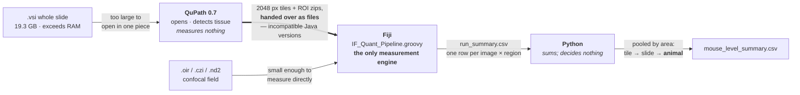

# IFQuant-Lung

[](https://github.com/xorca0711/IFQuant-Lung/actions/workflows/ci.yml)

**A reproducible pipeline for quantifying dysplastic KRT5⁺ repair in
influenza-injured mouse lung from multiplex immunofluorescence.** Fiji is the
sole measurement engine; QuPath handles whole-slide reading and tiling; Python
aggregates to the animal; a Windows launcher fronts all of it for operators.

Study question: does IFN-γ *ligand* knockout change the extent of dysplastic
KRT5⁺ repair after PR8 influenza injury? Endpoint after Lin et al. 2024
(*J Clin Invest* 134(19):e176828).



---

## What this demonstrated

Six results a reviewer can check. Numbers match the artefacts they came from.

**1 · Thresholds locked from controls, before the test data was opened.**
`IFQ_KRT5_THRESHOLD = 300`, derived from the two nominally uninfected animals
(in-tissue p99.99 = 283 and 255, worst-of-both) → control false-positive area
≤ 1e-4 in each independently. However, M6 LEFT has an established staining
failure, so the calibration currently rests on one sound control (M4-2) and must
be re-derived. Infected tissue measured 8.1 % of area above 500 — a result the
cutoff had no opportunity to manufacture.

**2 · A near-binary infected/uninfected separation — descriptive, not
inferential.**

| mouse | genotype | condition | KRT5⁺ area | KRT5 pods |
|---|---|---|---|---|
| M2 | hom | PR8 | **14.11 %** | 1080 |
| M4-1 | het | PR8 | **11.98 %** | 1094 |
| M4-2 | het | uninfected | **0.000 %** | 0 |
| M6 | hom | uninfected | **0.003 %** | ~0 |

T1α moves in the expected direction (AT1 loss after injury). **This describes
four animals. It is not a group comparison** — see result 6.

**3 · A silent segmentation defect, found and quantified.** A missing `black`
token in an ImageJ Binary Options macro string set `Prefs.blackBackground = false`
*globally*, inverting `Fill Holes` so every nucleus not touching the image frame
was erased. Nothing crashed; the output looked normal.

> pooled over 79 fields: **152.5 → 15,393.3 nuclei/mm², a ~101× undercount**

Diagnosed by **replay to IoU = 1.0000** against the shipped mask — which pins a
cause rather than suggesting one. Area outputs were then *measured* unaffected
(worst per-field change 0.0209 pp), so area results survive and every count does
not.

**4 · That defect is reproducible from a clean clone, with no data.**
A synthetic fixture runs the real engine code path twice, with and without the
token: 196 → 0 included nuclei, and the survivors are exactly the frame-touching
blobs — the same signature the real data showed.

**5 · An endpoint specification error, caught against the primary source.** The
implementation computed KRT5⁺PDPN**⁻**; the reference specifies KRT5⁺PDPN**⁺**
over a hand-traced PDPN⁻ ∪ KRT5⁺ union. PDPN is expressed *by* dysplastic cells,
so requiring PDPN-negativity had been excluding the population being measured.
The evaluator now **refuses to run** the corrected spec rather than dividing by a
denominator it cannot build.

**6 · The current design cannot test the genotype hypothesis.**
n = 1 mouse per genotype × condition cell, so genotype is confounded with
condition and the 14.11 vs 11.98 difference cannot be separated from M2 vs M4-1.
The reference used n = 15 per group. Stated as prohibitive, not as a caveat.

---

## Try it yourself

Both run from a clean clone with **no microscope data and no private drive**:

```bash
powershell -ExecutionPolicy Bypass -File ./validation/run_demo.ps1
powershell -ExecutionPolicy Bypass -File ./launcher/run_legacy_equivalence.ps1
```

The first demonstrates the segmentation defect and its fix. The second is an
execution-based backward-compatibility proof — 84 checks comparing what a *real
child process* receives, including the self-critical one that detects the
embedded engine has drifted from the version it claims equivalence to.

---

## What this demonstrates technically

- Scientific image-processing pipeline design — one authoritative measurement path
- Fiji/ImageJ + Groovy; QuPath whole-slide routing and tiling
- Python animal-level aggregation; C#/WinForms operator launcher
- Provenance and reproducibility from pixels → masks → cutoffs → animal-level output
- Validation against **both real and synthetic** failures
- Statistical-unit discipline, and fail-closed behaviour throughout
- Failure-mode analysis, with negative results preserved rather than deleted

---

## Where to go next

| If you want… | Read |
|---|---|
| **Current scientific state** — what is validated, exploratory, retracted | [`docs/PROJECT_STATE.md`](docs/PROJECT_STATE.md) |
| **The algorithm** — routing, decision hierarchy, cutoff derivation, Z policy | [`WORKFLOW.md`](WORKFLOW.md) |
| **Architecture, explorable** — pan/zoom, theme, focus views, export | [`docs/architecture.html`](docs/architecture.html) — download and open; GitHub shows source, not the render |
| **Negative results & retractions** — markers tested and rejected | [`docs/NEGATIVE_RESULTS.md`](docs/NEGATIVE_RESULTS.md) |
| **Validation** — the synthetic fixture and what it proves | [`validation/README.md`](validation/README.md) |
| **Authorship & AI-assisted development** | [`DEVELOPMENT.md`](DEVELOPMENT.md) |
| **Operator instructions** — running it at the microscope | [`launcher/README.md`](launcher/README.md) · [Releases](https://github.com/xorca0711/IFQuant-Lung/releases) |
| **Figures & display products** — merge panels vs QC overlays | [`docs/VISUAL_PANELS.md`](docs/VISUAL_PANELS.md) |
| **Historical / superseded material** | [`legacy/README.md`](legacy/README.md) · [`docs/ECTOPIC_POD_ENDPOINT.md`](docs/ECTOPIC_POD_ENDPOINT.md) |

---

## Status of the main claims

| | |
|---|---|
| **Validated** | tile→slide reconciliation (2.1e-16) · launcher legacy equivalence (84 checks) · KRT5 cutoff from controls · the segmentation defect, its fix, and the measured area regression |
| **Descriptive only** | the four-animal KRT5⁺ area table above |
| **Exploratory** | AGER and T1α calls — both constitutively expressed, so no negative-control anchor exists; labelled `adaptive_otsu_exploratory` |
| **Retracted / superseded** | AGER as a co-negativity marker · KRT8 as a discriminator · the KRT5⁺PDPN⁻ endpoint form |
| **Not established** | any genotype-level inference · a defensible corrected endpoint (executor implemented, T1A/PDPN uncalibrated and manual validation absent) · routes 1 and 2 end-to-end through the launcher UI |

An explicitly labelled engineering run of the corrected algebra now exists at
`D:\IFQ_Runs\confocal_260809_rerun`; it is not a reportable endpoint result.

**Licence:** [MIT](LICENSE), with a separate [scope note](LICENSE_SCOPE.md) for
image data, third-party tools, and unpublished findings.

---

## How to run

### Windows launcher (recommended for operators)

The `.exe` is **not committed** (it is gitignored; binaries belong in Releases).
Build it from the repository root:

```powershell
powershell -ExecutionPolicy Bypass -File .\launcher\build.ps1
```

The build runs `--self-test` and a UI smoke test and discards the binary on
failure. It prints the SHA-256 of the executable and of every embedded artefact
(engine, marker registry, QuPath tiling script, Python reconciliation), so a
shipped binary can be traced to the exact engine it carries.

Route is the first choice, before any folder:

| # | Route | Tools | Produces |
|---|---|---|---|
| 1 | IF — confocal / field images | Fiji only | `run_summary.csv` (+ `.xlsx`, `run_manifest.json`), one row per (image, region) |
| 2 | IF — slide scanner (`.vsi`) | QuPath → Fiji → Python | tiles → per-tile measurements → `stats/slide_level_summary.csv` |
| 3 | H&E / brightfield | QuPath engineering pilot | **launcher route disabled**; H0-H3 review artifacts only |
| 4 | Fiji-only legacy mode | Fiji only | the v1.7.2 environment and command line, verified by execution |

Route 3 is visible and greyed rather than hidden, with a written reason: the
fluorescence engine assumes bright signal on a dark background, which is
inverted for H&E, so pointing route 1 at an H&E slide **would not fail** — it
would produce a complete, plausible, wrong `run_summary.csv`. Route 2
hard-blocks a missing threshold; routes 1 and 4 only flag it, because a field
run with adaptive thresholds is a defensible exploratory measurement whereas a
slide run silently re-deriving a threshold on each of ~370 tiles is not one
measurement at all. Details in [`launcher/README.md`](launcher/README.md).

The H&E module has an executable, review-gated H0-H3 engineering pilot, but no
validated biological endpoint and no enabled launcher route. Its decision
hierarchy, endpoint tiers, fail-closed gates, executed 2026-08-12 pilot, and
study mapping are in
[`docs/HE_BRIGHTFIELD_DECISION_HIERARCHY.md`](docs/HE_BRIGHTFIELD_DECISION_HIERARCHY.md).
Machine-readable policy lives under `config/brightfield/`; study-specific
mouse/section identity lives under `config/studies/`.

### Field / confocal route, directly

A complete worked example is
[`scripts/run_confocal_260808.ps1`](scripts/run_confocal_260808.ps1) — the run
that produced the calibrated KRT5 result. The shape of it:

```powershell
$env:IFQ_INPUT_DIR       = 'D:\Confocal_Images\<batch>'   # samplesheet.csv must sit here
$env:IFQ_OUTPUT_DIR      = 'D:\IFQ_Runs\<run>\analysis'   # must be empty
$env:IFQ_RECURSIVE       = 'true'
$env:IFQ_INCLUDE_REGEX   = '.*20x 2k.*\.oir'              # full match on the ABSOLUTE path
$env:IFQ_PANEL_MAP_PATH  = 'D:\IFQ_Runs\<run>\panel_map.csv'
$env:IFQ_MARKER_REGISTRY = "$PWD\config\lung_marker_registry.json"
$env:IFQ_SEGMENTER       = 'classic'                      # headless-safe
$env:IFQ_KRT5_THRESHOLD  = '300'                          # frozen from controls

$java = (Get-ChildItem 'X:\Fiji\java' -Recurse -Filter java.exe | Select-Object -First 1).FullName
& $java '--add-opens=java.base/java.lang=ALL-UNNAMED' `
  '-javaagent:X:\Fiji\jars\ij1-patcher-2.0.0.jar=init' `
  '-Djava.awt.headless=true' '-Dplugins.dir=X:\Fiji' `
  -cp 'X:\Fiji\jars\*;X:\Fiji\plugins\*' net.imagej.Main --headless `
  --run '<repo>\IF_Quant_Pipeline.groovy'

python aggregate_to_mouse.py 'D:\IFQ_Runs\<run>\analysis\run_summary.csv'
```

On Windows ARM64 the Fiji launcher `.exe` itself does not start; invoking the
bundled JVM directly, as above, is the working path.

### Whole-slide route

```powershell
# Stage 1 — QuPath tiles the slide (measures nothing)
$env:IFQ_WSI_INPUT  = 'D:\Confocal_Images\<slides>'   # .vsi file or folder; .ets is refused
$env:IFQ_WSI_OUTPUT = 'D:\IFQ_Runs\<run>'
& 'X:\QuPath\QuPath-0.7.0 (console).exe' script qupath_wsi_tile_export.groovy

# Stage 2 — the same Fiji engine measures the tiles, sharded across cores
.\scripts\Invoke-Stage2Sharded.ps1 -TilesDir 'D:\IFQ_Runs\<run>\slideA\tiles' `
    -OutputRoot 'D:\IFQ_Runs\<run>\slideA' -Shards 5 -Krt5Threshold 300

# Stage 3 — reconcile tiles back to one slide, then roll up to mice
python aggregate_tiles_to_slide.py --slide-root 'D:\IFQ_Runs\<run>'
python aggregate_to_mouse.py 'D:\IFQ_Runs\<run>\stats\slide_level_summary.csv'
```

Stage 3 refuses to emit a summary when tiles are missing. Stage 2 does **not**
set thresholds: pass calibrated values, or the engine falls back to per-tile
adaptive Otsu, which on a mostly-background tile reports
`KRT5_pod_area_frac ≈ 0.89`.

### Requirements

- **[Fiji](https://fiji.sc/)** — hosts the measurement engine; required for both
  routes. Bio-Formats is bundled.
- **[QuPath](https://qupath.github.io/) 0.7+** — whole-slide route only.
- **StarDist + CSBDeep** update sites — recommended for nuclei; without them set
  `IFQ_SEGMENTER=classic` (watershed fallback, and the only headless-safe mode).
- **Python 3**, standard library only, for both aggregation scripts.
- Windows ARM64 or x64 with .NET Framework 4.x for the launcher.

## Repository map

| Path | What it is |
|---|---|
| `IF_Quant_Pipeline.groovy` | The measurement engine. Every number comes from here. Changes to it are deliberately rare. |
| `qupath_wsi_tile_export.groovy` | Stage 1 whole-slide front end: series selection, one global tissue detection, calibrated tiles with halos. Measures nothing. |
| `scripts/Invoke-Stage2Sharded.ps1` | Stage 2 fan-out over tiles using NTFS hard links (no image data copied). |
| `aggregate_tiles_to_slide.py` | Stage 3: tile → slide, with coverage reconciliation; refuses to summarise an incomplete slide. |
| `aggregate_to_mouse.py` | Region → mouse → group, area-weighted. Reports `n_mice`. Computes no p-values on purpose. |
| `endpoints/` | Relational endpoints (a relation *between* two markers) evaluated by boolean algebra on masks the engine already wrote. The engine is marker-wise and cannot express this; the endpoint scripts close that gap without modifying it. |
| `config/endpoints/` | Endpoint specifications as reviewable, diffable data — including the superseded one and why it was superseded. |
| `config/lung_marker_registry.json` | Marker aliases, localisation, analytical-role defaults. Not a whitelist and not a diagnostic classifier. |
| `launcher/` | C#/WinForms front end, its build script, and the executed legacy-equivalence harness. |
| `panels/` | Tracked figure rendering (merge panels, QC overlays). Mask-driven v8 was validated on 80 fields; see [`docs/VISUAL_PANELS.md`](docs/VISUAL_PANELS.md). |
| `docs/` | Depth: [`PROJECT_STATE.md`](docs/PROJECT_STATE.md) (living handoff), [`NEGATIVE_RESULTS.md`](docs/NEGATIVE_RESULTS.md), [`ECTOPIC_POD_ENDPOINT.md`](docs/ECTOPIC_POD_ENDPOINT.md), [`WSI_TILING_WORKFLOW.md`](docs/WSI_TILING_WORKFLOW.md), [`QUPATH_FIJI_INTEGRATION.md`](docs/QUPATH_FIJI_INTEGRATION.md), [`MARKER_MORPHOLOGY_GUIDE.md`](docs/MARKER_MORPHOLOGY_GUIDE.md), [`VISUAL_PANELS.md`](docs/VISUAL_PANELS.md). |
| `legacy/` | Non-authoritative archive. No threshold in it is current. |
| `WORKFLOW.md` | Superseded as an entry point; see the banner at its top. |

`docs/PROJECT_STATE.md` is the living scientific handoff. It was reconciled on
2026-08-09; if a historical document disagrees with it, the living handoff wins.

---

Everything below is reference detail. The five minutes' worth is above.

---

## Biological rationale

After severe influenza (PR8/H1N1) injury, p63⁺/KRT5⁺ distal-airway progenitors
(DASCs / LNEPs) expand and migrate into denuded alveolar zones, forming ectopic
**KRT5⁺ "pods"** — a marker of dysplastic, non-resolving repair that competes
with functional AT1/AT2 alveolar regeneration.

- **Reference result:** IFN-γ **receptor** KO reduces the pod region.
- **This study's question:** does IFN-γ **ligand** KO (Het / KO on a PR8
  background) also reduce it, while tracking the immune (CD4/CD8) and
  regenerative (AT1/AT2) response?

Two caveats that the image analysis cannot resolve, and does not pretend to:

- Global IFN-γ **ligand** KO alters injury severity differently from epithelial
  **receptor** KO. Keep an independent viral-clearance control (NP stain or
  qPCR) outside this pipeline; it does not correct for differences in viral
  load.
- With one animal per genotype × condition cell, genotype and condition cannot
  be separated at all. See "What is not established".

### The endpoint, and its correction

The reference endpoint (Lin et al. 2024) is

```
dysplastic fraction = KRT5+ PDPN+ area / (PDPN- OR KRT5+) area
```

where the denominator is **hand-traced** on a whole-lobe mosaic. This repository
first implemented the numerator with the sign inverted (KRT5⁺PDPN⁻) and the
denominator as a computed AGER-density damage mask, and quoted the paper to
justify both. Reading the figure legends verbatim showed the opposite. The
corrected specification is
[`config/endpoints/dysplastic_over_damaged.json`](config/endpoints/dysplastic_over_damaged.json);
it declares the relation as data, records what it supersedes and why, and is
evaluated by mask algebra rather than by editing the engine. The executor now
implements the intersection/union algebra and refuses uncalibrated parameters by
default. No corrected value is scientifically reportable until T1A/PDPN is
calibrated and the result is checked against manual outlines.

## Panels and marker configuration

### Priority project panels

| Preset | Acquisition channels | Tracked cell counts | Area readouts |
|---|---|---|---|
| `LEFT` | C1 DAPI; C2 KRT5-488; C3 AGER-555; C4 T1alpha-647 | KRT5, AGER, T1A final positive/negative/indeterminate | KRT5 pod area; AGER and T1A membrane-positive area |
| `RIGHT` | C1 DAPI; C2 Pro-SPC-488; C3 AGER-555; C4 KRT8-647 | ProSPC, AGER, KRT8 final positive/negative/indeterminate | AGER membrane-positive area only |
| `ALI1` | C1 DAPI; C2 SCGB3A2-488; C3 tdTOM; **C4 p63-647** | C4 p63 primary; SCGB3A2 and tdTOM secondary | tdTOM reporter area; transitional SCGB3A2⁺/p63⁺ class |
| `ALI2` | C1 DAPI; C2 KRT5-488; C3 tdTOM; **C4 AcTub-647** | C4 AcTub primary, filtered to cilia-like tufts | apical ciliary area/components; KRT5 and tdTOM area |
| `ALI3` | C1 DAPI; C2 KRT5-488; C3 tdTOM; **C4 MUC5AC-647** | C4 MUC5AC primary | apical MUC5AC area/components; KRT5 and tdTOM area |
| `ALI1_MAP` | C1 DAPI; C2 SCGB3A2-488; C3 tdTOM | 4× mapping subset; p63 absent, no call | tdTOM reporter area |
| `ALI23_MAP` | C1 DAPI; C2 KRT5-488; C3 tdTOM | 4× mapping subset; C4 absent, no call | KRT5 and tdTOM reporter area |

Marker identity and acquisition index are authoritative; displayed colours are
not. `T1A` is the output label for T1alpha/podoplanin and `ProSPC` for
Pro-SPC/SFTPC.

Original study panels, retained:

| Panel | Channels (acquisition order) | Purpose | Key classification |
|:-----:|---|---|---|
| **A** | DAPI · KRT5 · AGER | Pod area + AT1 (RAGE) boundary | KRT5⁺ area vs AGER⁺ area |
| **B** | DAPI · KRT5 · Pro-SPC | Regeneration readout (AT2) | KRT5⁻/Pro-SPC⁺ |
| **C** | DAPI · KRT5 · CD8 | Cytotoxic T-cell infiltrate | CD8⁺, KRT5⁺/CD8⁺ |
| **D** | DAPI · KRT5 · CD4 | Helper T-cell infiltrate | CD4⁺, KRT5⁺/CD4⁺ |
| **P** | DAPI · KRT5 · PDPN | AT1 (T1-α/podoplanin) | **KRT5⁺/PDPN⁺** (corrected sign) |
| **S** | DAPI · KRT5 · Sox2 | Airway/epithelial (optional) | KRT5⁺/Sox2⁺, KRT5⁺/Sox2⁻ |
| **S2** | DAPI · KRT5 · p63 · YAP | Scheme 2 (future) mechanistic | KRT5⁺/p63⁺, KRT5⁺/YAP⁺ |

Panel A's KRT5⁺/AGER⁻ classification is **retired**: AGER co-negativity was
tested and retracted (R ≈ 0.99–1.05; the removal was definitional, not
biological). See [`docs/NEGATIVE_RESULTS.md`](docs/NEGATIVE_RESULTS.md).

### Marker roles the engine understands

- **nuclear** (DAPI) — segmentation channel.
- **cyto** (KRT5, KRT8, Pro-SPC, CC10, tdTomato) — perinuclear ring.
- **membrane** (AGER, PDPN, T1A, mRAGE, CD4, CD8) — local membrane-support ring.
- **nuc_marker** (p63, Sox2) — inside the nucleus.
- **nuc_ratio** (YAP) — nucleus vs a true cytoplasmic ring; needs a single Z
  plane.
- **apical_cilia** (acetylated α-tubulin) — thresholded apical patches plus an
  explicitly approximate nucleus-proximity association.
- **regional_area** (COL1A1, CTHRC1, ACTA2, mucins) — positive-area mask with no
  per-nucleus call.

For a new study, copy
[`config/custom_panels.example.json`](config/custom_panels.example.json), edit
the channel indices and marker set, and load it with `IFQ_PANEL_CONFIG`. Do not
edit the built-in `PANELS`: a study-owned JSON keeps the channel map versioned
independently from the engine. The registry is not a whitelist; an unknown
marker can be used by declaring its role explicitly. See
[`docs/UNIVERSAL_MARKER_CONFIGURATION.md`](docs/UNIVERSAL_MARKER_CONFIGURATION.md)
and
[`docs/COMPARTMENT_TAGS_AND_PROGRESSION.md`](docs/COMPARTMENT_TAGS_AND_PROGRESSION.md).

### Morphology-first call authority

The final marker call has three states: positive, negative, or **indeterminate**.
An intensity cutoff defines candidate positive pixels; a final positive then
requires the marker-specific minimum spatial coverage, connected pattern,
localisation/enrichment rule, unique ownership where applicable, and anatomical
context policy. A known incompatible compartment, missing context with no
positive evidence, invalid YAP projection, empty support, or support shared
between cells yields **indeterminate rather than negative** — an unresolved
anatomy is never silently counted as a biological negative.

`<marker>_pos` is the legacy mean-intensity audit value. Classifications and
counts use `<marker>_final_call` and never the raw intensity result. Adaptive
Otsu calls are explicitly exploratory; confirmatory analysis requires fixed,
control-derived `IFQ_<MARKER>_THRESHOLD` values.

## Where things happen in the code

| Capability | Implementation |
|---|---|
| Read original files via Bio-Formats, keep metadata and calibration | `bfOpen()` — no autoscale |
| Split channels, preserve Z-stack and calibration | `ChannelSplitter.split` + `projectChannel` (calibration re-applied) |
| Tissue / lesion ROIs | `resolveTissueRois()` — manual `RoiSet.zip`/`.roi` if present, else auto from DAPI |
| Nuclei and cells | `segmentNuclei()` — StarDist preferred, classic watershed fallback; perinuclear ring is the "cell" |
| KRT5⁺ pod area and counts | independent threshold mask → `positiveAreaInRoi` + Analyze Particles |
| Membrane markers (AGER / PDPN / T1A) | ring/membrane support measurement |
| Relations between two markers | `endpoints/evaluate_endpoints.groovy`, mask algebra outside the engine |
| Every threshold, filter, plugin version, parameter | `*__params.json` + `run_manifest.json`; resolved thresholds also in `run_summary.csv` |

## Input data expectations

- **Formats:** anything Bio-Formats reads (`.czi`, `.lif`, `.nd2`, `.oir`,
  `.oib`, `.oif`, `.ics`, `.tif/.tiff`). Slide-scanner `.vsi` is deliberately
  **not** in this list — the engine never opens one directly; QuPath tiles it
  first. Never point anything at a `.ets` file: those are internal pyramid tiles
  inside the hidden `_<name>_` folder, and reading one gives a partial image.
- **Calibration:** positive square-pixel dimensions in micrometres are required.
  The pipeline stops rather than silently treating pixels as micrometres.
- **Metadata resolution order** per file:
  1. `samplesheet.csv` row matched by `relative_path`, then exact `filename` —
     preferred; `relative_path` is required when filenames repeat in a recursive
     tree;
  2. otherwise the filename convention `mouseID_condition_panel_section.ext`
     (e.g. `m01_PR8_A_s1.czi`);
  3. otherwise the script defaults (`PANEL`, `genotype = NA`).

`IFQ_OUTPUT_DIR` must be empty, which prevents stale masks and cell tables from
a previous run being mixed with new ones. Set
`IFQ_ALLOW_NONEMPTY_OUTPUT=true` only after reviewing the existing folder.

## Configuration reference (most-used knobs)

| Parameter | Meaning |
|---|---|
| `IFQ_PANEL_MAP_PATH` | `relative_path,panel` CSV for strict per-image routing; generated by launcher AUTO and copied into results |
| `IFQ_SEGMENTER` | `stardist` (preferred) or `classic` watershed (headless-safe) |
| `STARDIST_PROB` / `STARDIST_NMS` | detection probability / overlap thresholds |
| `IFQ_PROJECTION` | `max` (CLI default), `layer_aware` marker-specific slabs, `sum`, `avg`, `single` |
| `IFQ_SINGLE_PLANE` | 1-based plane index when projection is `single`; `-1` = middle |
| `IFQ_Z_NUCLEAR_RANGE` / `IFQ_Z_CELL_BODY_RANGE` / `IFQ_Z_APICAL_RANGE` | `full`, `auto`, or inclusive `start:end` |
| `IFQ_Z_CELL_BODY_PLANES` / `IFQ_Z_APICAL_PLANES` | automatic slab widths; defaults 5 and 3 planes |
| `IFQ_DAPI_METHOD` | `local_phansalkar` or `global_otsu`; layer-aware mode defaults to global Otsu |
| `IFQ_DAPI_BACKGROUND_RADIUS_UM` / `IFQ_DAPI_LOCAL_RADIUS_UM` / `IFQ_DAPI_BLUR_SIGMA_PX` | DAPI preprocessing; the defaults were tuned on slide-scanner data and are a live calibration question on confocal fields |
| `IFQ_MIN_NUCLEUS_AREA_UM2` | size floor for accepted nuclei |
| `IFQ_MIN_INCLUDED_NUCLEI` | minimum included nuclei per region; default `1` prevents a false-success zero-cell result |
| `IFQ_RING_EXPAND_UM` | perinuclear ring width for the cytoplasm/membrane proxy |
| `IFQ_ALLOW_NONEMPTY_OUTPUT` | `false` by default; prevents stale mixed-run exports |
| `POD_MIN_AREA_UM2` / `POD_THRESH_METHOD` | pod particle size floor and auto-threshold method |
| `POS_SENSITIVITY` | per-marker multiplier on the auto threshold (`>1` stricter) |
| `IFQ_MORPHOLOGY_PRIMARY` | must remain `true`; intensity-only final calls are rejected |
| `IFQ_WHOLE_FIELD_COMPARTMENT` | explicit context for a reviewed homogeneous field: `airway`, `alveolar`, `tumor`, `fibrotic`, `stromal`, `vascular`, `immune`, `ambiguous`, `unassigned` |
| `IFQ_<MARKER>_THRESHOLD` | fixed control-derived candidate-pixel cutoff (non-alphanumerics are stripped: `tdTOM` → `IFQ_TDTOM_THRESHOLD`) |
| `IFQ_<MARKER>_MIN_POSITIVE_FRACTION` | minimum fraction of role-specific support above cutoff |
| `IFQ_<MARKER>_MIN_LARGEST_COMPONENT_SHARE` | minimum connectedness of positive support |
| `IFQ_ACTUB_*` | cilia-specific seed percentile, local density, support width, and patch-area bounds |
| `IFQ_EXPORT_DISPLAY_CHANNELS` / `IFQ_DISPLAY_*` | display-only enhancement; never touches the quantitative branch |
| `TISSUE_THRESH_METHOD` / `TISSUE_MIN_AREA_UM2` | auto tissue detection when no manual ROI |
| `IFQ_WSI_*` | Stage 1 tiling only — see [`docs/WSI_TILING_WORKFLOW.md`](docs/WSI_TILING_WORKFLOW.md) |

## Outputs

```
OUTPUT_DIR/
├── run_summary.csv                     # per-region summary — input to aggregate_to_mouse.py
├── run_manifest.json                   # versions, full config, per-image status
└── <image_stem>/
    ├── <stem>__cells.csv               # one row per nucleus/cell
    ├── <stem>__params.json             # parameters, calibration, channel map, thresholds
    ├── <stem>__z_plane_profile.csv     # per-plane signal profile and selected Z ranges
    ├── <stem>__<region>__QC.png        # tissue (white), nuclei (cyan), KRT5⁺ (magenta), pods (yellow)
    ├── <stem>__<region>__nuclei_mask.tif
    ├── <stem>__<region>__<marker>_morphology_positive_nuclei_mask.tif
    ├── <stem>__<region>__<marker>_indeterminate_nuclei_mask.tif
    ├── <stem>__<region>__<marker>_CALL_QC.png
    ├── <stem>__KRT5_pod_mask.tif
    └── <stem>__T1A_membrane_positive_mask.tif    # analogous AGER/PDPN/mRAGE masks
```

Every display PNG is labelled **DISPLAY ONLY - NOT QUANTIFIED** and the merged
figure **VISUAL MERGE PANEL - NOT QUANTIFIED**. Percentile stretching and gamma
are applied to duplicate 8-bit copies; segmentation, thresholds, masks,
morphology features and final calls use the original calibrated projections.

A confocal run is about 7.6 GB: 5.9 GB of uncompressed 2048² mask TIFFs, 1.7 GB
of QC PNGs, and 2.7 MB of actual numbers. The masks must be kept — the endpoint
scripts do mask algebra on them — but they compress 50–100×.

Key `run_summary.csv` columns (marker columns vary by panel):

- `image, output_key, mouse_id, section_id, genotype, condition, panel, region`
  — identifiers.
- `region_area_um2, n_nuclei` — denominators.
- `n_nucleus_candidates_total`, acceptance/rejection fractions, rejection-reason
  counts — segmentation QC. Watch these: they are what exposed the
  `blackBackground` bug.
- `<marker>_pos_threshold`, `<marker>_threshold_source` — the resolved cutoff and
  whether it was fixed or adaptive. **Check this before quoting any number.**
- `<marker>_morphology_pos_count`, `_morphology_negative_count`,
  `_indeterminate_count`, `_morphology_evaluable_count` — the three-state summary.
- `<marker>_final_positive_cell_count` and the `_fraction_of_total_cells`
  companions — the primary per-cell tracking fields.
- `<marker>_marker_evidence_pos_count`, `_context_unresolved_positive_count`,
  `_context_excluded_evidence_positive_count` — strict evidence before or
  alongside anatomical eligibility, so context loss is visible instead of
  resembling a biological negative.
- `KRT5_pod_area_um2`, `KRT5_pod_area_frac`, `KRT5_n_pods`, `KRT5_pod_threshold`
  — the area endpoint.
- `<marker>_positive_area_um2`, `_positive_area_frac`, `_n_components`,
  `_area_mode` — morphology-neutral regional fields.
- `class_<rule>_count`, `_evaluable_count`, `_indeterminate_count` — every
  declared class is emitted even when all cells are indeterminate.

After `aggregate_to_mouse.py`:

- **`mouse_level_summary.csv`** — one row per (mouse × panel); fractions and
  densities are **area-weighted** across sections (`Σ area / Σ area`, not a mean
  of percentages).
- **`group_level_summary.csv`** — mean / sd / sem / `n_mice` per
  (genotype × condition × panel × metric).

## Statistics: n is mice

Three technical sections from one animal are still n = 1. `mouse_id` and
`section_id` travel through every export precisely so the collapse to animal
happens before any test. `aggregate_to_mouse.py` does that collapse
(area-weighted) and reports `n_mice`. It deliberately computes no p-values:
export `mouse_level_summary.csv` and apply the appropriate test elsewhere.

For the current batch that is moot. **n = 1 per genotype × condition cell, and
genotype is confounded with condition.** The numbers in this repository describe
individual animals and support no inference. Reporting them as group results
would be wrong regardless of how they were computed.

## Threshold-tuning workflow

1. Run 2–3 representative images with default settings.
2. Open the `__QC.png` and `__CALL_QC.png` overlays. Are nuclei split correctly?
   Do positives sit where you would put them by eye? Check the nucleus
   acceptance/rejection fractions, not only the picture.
3. Adjust: under-segmented nuclei → `STARDIST_PROB` / `STARDIST_NMS`; too
   many/few positives → `POS_SENSITIVITY[marker]`; pod mask too greedy or sparse
   → `POD_THRESH_METHOD`, `POD_BLUR_SIGMA_PX`, `POD_MIN_AREA_UM2`.
4. Derive fixed cutoffs from **controls only**, without consulting the
   experimental groups' outcomes.
5. Freeze every parameter and batch the cohort with identical settings. Never
   tune per image across a cohort.

A marker that is constitutively expressed gives no calibration handle from "the
control should be negative" — an adaptive threshold moves with the data and
cannot detect a shift. That is why AGER and T1A remain exploratory here, and it
is the same trap that made KRT5 uncalibratable on the slide scanner and KRT8
undiagnostic on confocal.

## Caveats and interpretation

- **AGER/PDPN are thin membrane signals.** Per-cell mean intensity is weak; area
  relationships are more robust than per-object AT1 calls.
- **Projection matters.** MAX projection is fine for pod area. For YAP it
  corrupts the nuclear:cytoplasmic ratio — use `IFQ_PROJECTION=single`.
- **Automatic Z ranges are pilot settings.** Replace them with fixed ranges after
  QC. See [`docs/Z_STACK_ANALYSIS.md`](docs/Z_STACK_ANALYSIS.md).
- **Adaptive thresholds are exploratory placeholders**, and the engine labels
  them as such. Confirmatory results require fixed marker cutoffs and frozen
  morphology parameters.
- **Machine limits shape what is possible.** Snapdragon X Oryon, 8 cores,
  15.6 GB RAM, ARM64. A full-resolution slide is 19.3 GB, which is why tiling is
  mandatory and why the PDPN ceiling has still not been measured at full
  resolution. Keep `-Xmx` at or below ~40 % of RAM; earlier `-Xmx12g` runs paged
  to disk and the symptom looked like slow I/O.

## Reproducibility and provenance

Every run records ImageJ, Bio-Formats, Java and OS versions
(`run_manifest.json`); the full configuration including segmenter, projection,
`blackBackground`, tissue method and sensitivities; per-image calibration and
channel→marker map; and the **resolved numeric thresholds** for pods and each
marker. StarDist/CSBDeep model and parameters are captured; exact plugin build
strings are not reliably queryable from a script and must be noted from
`Help ▸ Update`.

## Troubleshooting

| Symptom | Fix |
|---|---|
| `INPUT_DIR is not a folder` | set `IFQ_INPUT_DIR` before launching Fiji |
| `OUTPUT_DIR is not empty` | use a new run directory; do not mix old and new masks |
| `No images matched` | `IFQ_INCLUDE_REGEX` is a full match against the absolute path |
| `Found N channels but panel references channel M` | fix the panel `idx` map or samplesheet panel; the image is recorded as failed |
| StarDist errors / not found | install CSBDeep + StarDist, or set `IFQ_SEGMENTER=classic` |
| Nucleus counts implausibly low, masks look like rim fragments | the `blackBackground` failure mode; check that candidate components are not ~100 % border-touching, and see `IF_Quant_Pipeline.groovy:1765-1783` |
| Areas inverted or zero | the pipeline forces `blackBackground=true`; if you edited masking, keep foreground = 255 |
| Densities 10–100× off | check the embedded calibration (µm/pixel) in the source files |
| Fiji `.exe` will not start (ARM64) | invoke the bundled JVM directly, as in the field-route example above |
