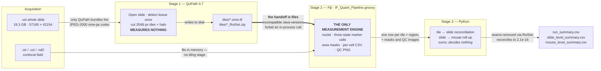
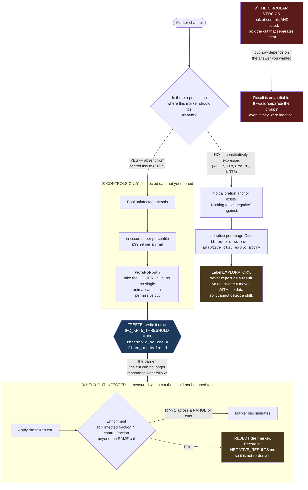
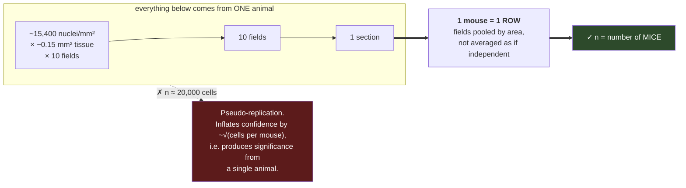
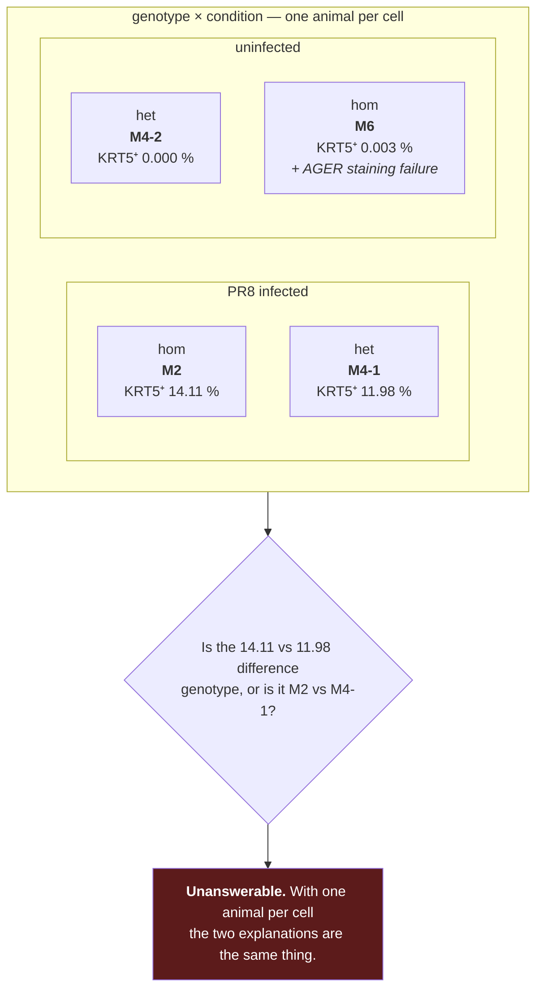
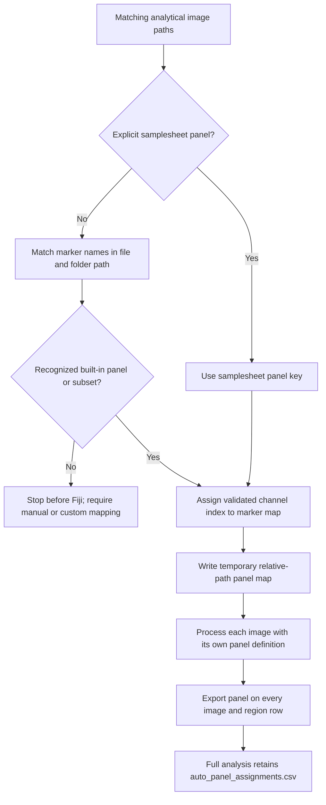
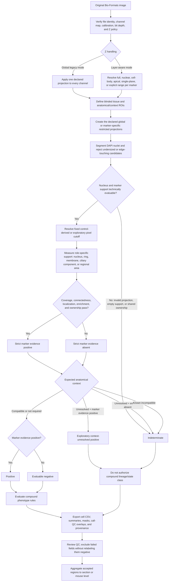
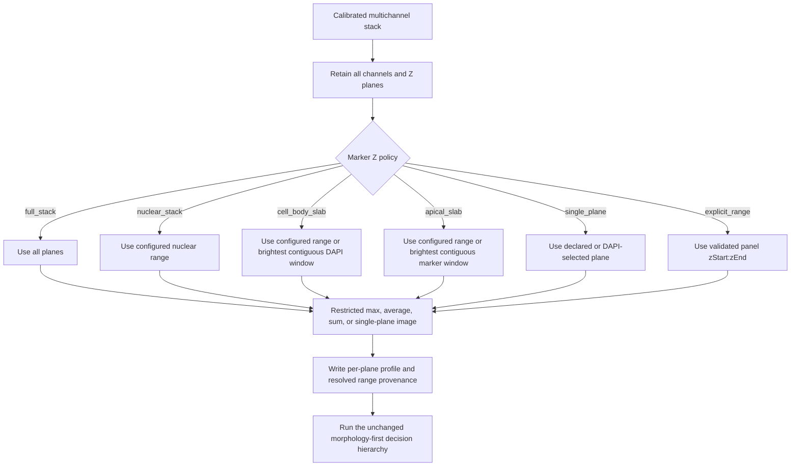
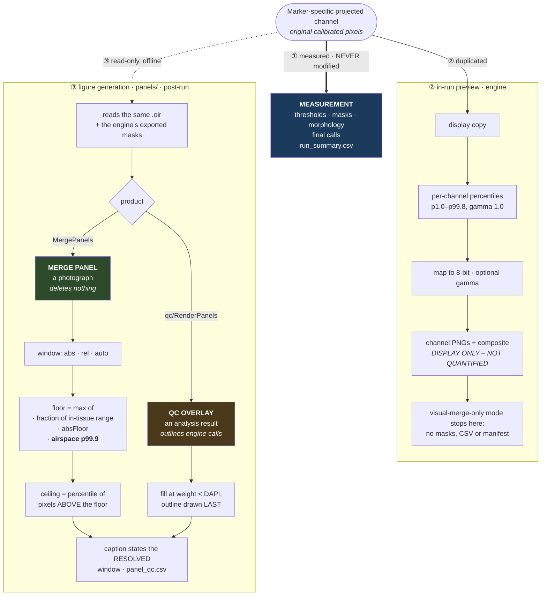

# Workflow — algorithmic reference

> **Status: CURRENT.** This is the operational and interpretation reference for
> the morphology-first measurement engine: how an image is routed, how a marker
> call is decided, and what each decision node guarantees.
>
> [`README.md`](README.md) is the entry point and states what is validated.
> This document states **how the algorithm works**.
> Last checked: 2026-08-09.

Final marker calls are determined by **role-appropriate spatial morphology**.
Mean intensity is retained for audit but does not authorize a positive or
negative call. The numeric morphology settings below are conservative pilot
defaults, not universal biological cutoffs: derive intensity cutoffs and
validate morphology parameters on blinded controls, then freeze them before
comparing experimental groups.

## Pipeline overview



**Why the split.** QuPath alone can open Olympus `.vsi` (it bundles the
JPEG-2000 `ome-jai` codec Fiji's Bio-Formats lacks) and alone can tile an image
larger than RAM. The two applications ship **incompatible Java versions**, so
the handoff is files on disk, not an in-process call — the pattern in Chiaruttini
et al. 2022 (*Front Comput Sci* 3:780026). A second measurement engine inside
QuPath was evaluated and rejected: two engines drift, and a result then depends
on which one produced it. **One engine measures; QuPath reads and cuts; Python
only sums.**

## Cutoff derivation — the anti-circularity rule

A cutoff chosen to separate the groups being compared is not a measurement of
those groups. The engine therefore distinguishes two provenances and labels
every output accordingly.



**Worked example, KRT5.** Uninfected in-tissue p99.99 = 283 (M4-2) and 255 (M6);
cutoff frozen at **300**, giving control false-positive area ≤ 1e-4 in each
independently. Infected tissue then measured **8.1 %** of area above 500 — a
number the cutoff had no opportunity to manufacture.

**Where the left branch was unavailable.** AGER and T1α are expressed in healthy
lung, so "controls should be negative" anchors nothing; both remain
`adaptive_otsu_exploratory`. Two markers reached node **O** and were rejected on
evidence: AGER as a co-negativity marker (R ≈ 0.99–1.05) and KRT8 as a
discriminator (R = 0.80–1.25 at every cut). See
[`docs/NEGATIVE_RESULTS.md`](docs/NEGATIVE_RESULTS.md).

## Statistical unit

### What counts as a replicate



Nuclei, fields, regions and sections within one animal are **not independent
biological replicates** — they share its genotype, its infection, its section,
its staining batch and its imaging session. `aggregate_to_mouse.py` enforces the
roll-up and prints the distinct-animal count so the unit cannot be mistaken.

### Why this dataset cannot support a comparison

The problem is not only that n is small. It is that the design is **saturated**:
every cell of the 2 × 2 holds exactly one animal, so *genotype* and *condition*
cannot be separated from *animal identity*.



**What the data does support:** the infected/uninfected contrast is near-binary
(≈12–14 % against ≈0 %) and consistent in direction with T1α loss, so the
*measurement* is behaving as expected. **What it does not support:** any claim
about the IFN-γ genotype, which is the study question. That needs replicate
animals per cell — the reference used **n = 15 per group**.

This is a study-design constraint. No amount of additional fields, cells or
software rigour changes it, and no analysis in this repository should be written
as though it does.

## Active entry points

Whole-slide entry points not covered by this document:
`qupath_wsi_tile_export.groovy` (QuPath, Stage 1 tiling),
`scripts/Invoke-Stage2Sharded.ps1` (parallel engine runs over tiles), and
`aggregate_tiles_to_slide.py` (tile → slide, with coverage reconciliation).


- [`IF_Quant_Pipeline.groovy`](IF_Quant_Pipeline.groovy): production
  Fiji/ImageJ analysis.
- [`aggregate_to_mouse.py`](aggregate_to_mouse.py): region-to-mouse aggregation.
- [`samplesheet_template.csv`](samplesheet_template.csv): metadata template.
- [`README.md`](README.md): installation, panel definitions, configuration, and
  output schema.
- [`docs/MARKER_MORPHOLOGY_GUIDE.md`](docs/MARKER_MORPHOLOGY_GUIDE.md): extended
  morphology and literature notes.
- [`docs/UNIVERSAL_MARKER_CONFIGURATION.md`](docs/UNIVERSAL_MARKER_CONFIGURATION.md):
  reusable marker, disease-context, panel, and ROI-tag hierarchy.
- [`docs/UNIVERSAL_FALSE_NEGATIVE_AUDIT_20260728.md`](legacy/docs/UNIVERSAL_FALSE_NEGATIVE_AUDIT_20260728.md):
  cross-marker context/evaluability audit and representative Fiji regressions.
- [`docs/COMPARTMENT_TAGS_AND_PROGRESSION.md`](docs/COMPARTMENT_TAGS_AND_PROGRESSION.md):
  anatomical tag meanings, subcellular analytical roles, ROI naming, and
  image-to-call progression.
- [`docs/Z_STACK_ANALYSIS.md`](docs/Z_STACK_ANALYSIS.md): layer-aware Z policies,
  automatic or fixed slab selection, per-plane QC, and the boundary between
  restricted 2.5D projections and true 3D analysis.
- [`config/lung_marker_registry.json`](config/lung_marker_registry.json): marker
  aliases, localization, lineage/state notes, and analytical-role defaults.
- [`config/custom_panels.example.json`](config/custom_panels.example.json):
  opt-in study panel templates; built-in panels remain unchanged.
- [`docs/PILOT_G002_MORPHOLOGY_RESULTS.md`](legacy/docs/PILOT_G002_MORPHOLOGY_RESULTS.md):
  validated one-image pilots.

## Priority real-project antibody panels

The pipeline remains universal: registry markers, legacy panels, study-owned
custom panels, morphology-first decisions, and per-image cell counts all remain
available. The following two channel maps are the priority presets for the real
project:

| Preset | C1 | C2 | C3 | C4 |
|---|---|---|---|---|
| `LEFT` | DAPI | KRT5-488 | AGER-555 | T1alpha-647 |
| `RIGHT` | DAPI | Pro-SPC-488 | AGER-555 | KRT8-647 |

The 260730-CW ALI Z-stack acquisitions are available as additional presets:

| Preset | C1 | C2 | C3 | C4 |
|---|---|---|---|---|
| `ALI1` | DAPI | SCGB3A2-488 | tdTomato | p63-647 |
| `ALI2` | DAPI | KRT5-488 | tdTomato | acetylated-tubulin-647 |
| `ALI3` | DAPI | KRT5-488 | tdTomato | MUC5AC-647 |

The ALI presets declare nuclear, cell-body and apical Z policies but do not
replace `LEFT`/`RIGHT` as the priority biological panels.

Primary tracking is per image and per marker: total included DAPI cells,
final-positive cells, final-negative cells, indeterminate cells, and
final-positive fraction of total included cells. KRT5 also retains pod-area
quantification; AGER and T1alpha retain membrane-positive-area quantification.
Co-expression classes are secondary descriptive endpoints and do not replace
the individual marker counts.

Marker-specific support remains unchanged:

- KRT5 and KRT8: connected perinuclear cytoplasmic keratin support;
- Pro-SPC: connected granular perinuclear cytoplasmic support;
- AGER and T1alpha: connected thin-membrane support in an alveolar context;
- DAPI: nuclear segmentation and the denominator for included cells.

The same three-state decision hierarchy applies to both presets. In particular,
an alveolar-marker negative requires a compatible independently declared
alveolar context; unresolved anatomy is not silently counted as negative.

## Universal marker-selection hierarchy

Before analyzing a new marker set, freeze these layers in order:

1. Research question and biological unit: lineage, transient state,
   localization, regional burden, or spatial relationship.
2. Species, preparation, modality, antibody clone, and known controls.
3. Blinded anatomical/context ROIs.
4. A lineage anchor, state marker, and nearest-alternative/exclusion marker.
5. Analytical role: nuclear, nuclear ratio, cytoplasmic, membrane, apical
   cilia, or regional area.
6. Channel map and projection policy for the actual acquisition.
7. Control-derived intensity cutoff and validated morphology/size gates.

Marker identity, image channel, analytical geometry, and biological
interpretation are separate. A marker registry entry may supply a geometry
default, but it never assigns a disease diagnosis or a final cell identity.
Unknown markers remain supported when the custom panel declares their role.

For the newly expanded profiles: KRT8 uses connected cytoplasmic filament
support; ITGA2/CD49b uses connected membrane support; SOX9 requires connected
DAPI-nuclear enrichment; and PDGFRB is preferably a regional/perivascular area
endpoint at 20x, with per-nucleus membrane calls reserved for validated
high-resolution ownership. Red2-Kras uses connected cytoplasmic RFP reporter
support with clone area primary at 20x; RFP-positive marks the verified
oncogene-coupled clone, whereas RFP-negative alone is not a wild-type call.
Pan-KRAS uses connected cytoplasmic/inner-membrane protein support but does not
imply a KRAS mutation. Ki-67/MKI67 uses connected nuclear enrichment and is
summarized as a labeling index inside a predeclared population or ROI. `IGTA2`
is accepted as an alias of canonical `ITGA2`. Except for the construct-linked
Red2-Kras RFP interpretation, none of these markers assigns a lineage,
mutation, malignancy, or disease state by itself.

## End-to-end workflow

### Per-image panel and channel routing



AUTO no longer requires one panel for the entire directory. Every image is
allocated independently, but allocation remains strict: a recognized
samplesheet key or built-in marker combination must resolve before Fiji starts.
The map selects a validated panel definition; it does not infer marker identity
from pixel color or intensity. Images with absent channels use a declared subset
panel, so absent markers produce no cell decision rather than a false negative.
The known 4× ALI subsets are `ALI1_MAP` (DAPI, SCGB3A2, tdTOM) and
`ALI23_MAP` (DAPI, KRT5, tdTOM).



### Layer-aware Z routing



#### What each schematic block does

| Block | Algorithmic meaning | Output or safeguard |
|---|---|---|
| **A. Calibrated multichannel stack** | Bio-Formats imports the original channels and Z planes. The pipeline requires positive XY calibration and, for a multi-plane layer-aware run, positive Z spacing. | Preserves physical units and rejects an uncalibrated stack instead of applying pixel-based biological distances. |
| **B. Retain all channels and Z planes** | Channels are split without collapsing Z. The declared channel index is checked against the acquired channel count. | Prevents a single global projection from erasing marker-specific depth information. |
| **C. Marker Z policy** | Each panel channel receives a policy from its panel definition, marker registry, or role default. A panel-specific declaration has priority. | Routes every marker deterministically and records the policy used. |
| **D. `full_stack`** | Select planes 1 through the final plane. This is appropriate for robust regional signal or a complete DAPI overview. | Full-stack inclusive range. |
| **E. `nuclear_stack`** | Use `IFQ_Z_NUCLEAR_RANGE`; `full` is the default, `auto` selects the brightest DAPI plane, and `start:end` freezes a validated range. | Nuclear-localized marker range that is independent of cytoplasmic/apical ranges. |
| **F. `cell_body_slab`** | Use the configured cell-body range, or select the brightest contiguous DAPI window of `IFQ_Z_CELL_BODY_PLANES` planes. The window score is the summed DAPI signal. | DAPI-guided epithelial/cell-body slab for keratins, reporters, secretory cytoplasm, Pro-SPC, and related markers. |
| **G. `apical_slab`** | Use the configured apical range, or select the brightest contiguous window in that marker's own channel using `IFQ_Z_APICAL_PLANES`. | Marker-guided luminal/apical slab for AcTub, MUC5AC, and similarly localized structures. |
| **H. `single_plane`** | Use an explicitly declared plane; otherwise use the configured global plane or a DAPI-selected plane. | A local optical section for ratios such as nuclear YAP, where a projection would mix compartments. |
| **I. `explicit_range`** | Require and validate the panel's 1-based inclusive `zStart:zEnd`. Out-of-stack values stop the image. | Frozen, study-specific range suitable for a confirmatory cohort. |
| **J. Restricted projection** | Project only the resolved range with the declared `max`, `avg`, `sum`, or `single` method. The default is maximum intensity within the restricted slab. | One marker-specific 2D analysis image; the source stack remains unchanged. |
| **K. Profile and provenance** | Export every plane's intensity profile, selected status, resolved range/source, projection, automatic score, and intensity-weighted Z centroid. | Makes automatic selection auditable and allows a fixed range to be chosen before confirmatory analysis. |
| **L. Morphology-first hierarchy** | Feed the marker-specific projection into the same pixel-threshold, localization, connectedness, compartment, ownership, and evaluability rules used by the established workflow. | Z routing changes the optical support presented to the decision algorithm; it does not replace or weaken the final marker rules. |

The automatic branches select a range from image signal only. They do not use
condition, genotype, experimental group, or the eventual positive/negative
cell calls. When acquisition orientation is reproducible, inspect pilot Z
profiles and replace `auto` with predeclared ranges before cohort-level
statistics.

Automatic windows are deterministic pilot choices. A confirmatory cohort
should use explicit ranges whenever acquisition orientation and depth are
consistent. The current layer-aware path is 2.5D: it restricts projections but
does not claim 3D cell-boundary reconstruction.

### Visualization-only channel enhancement

Three consumers read the same projected channel. Only one may influence a
number, and no arrow crosses between lanes.



**The invariant:** the original projected pixels are the *only* source for
thresholds, masks, intensity audit fields, morphology features and final calls.
Display copies are duplicates; no display transform can reach a number. That is
why the graph above has one heavy edge into the measurement branch and a dotted
read-only edge into figure generation.

**Two display paths, deliberately different.** The engine's in-run preview
(left) is a per-image percentile stretch for QC glancing. The `panels/` module
(right) is offline figure generation and is documented in
[`docs/VISUAL_PANELS.md`](docs/VISUAL_PANELS.md). It splits into two products
that must never be confused:

| | merge panel | QC overlay |
|---|---|---|
| what it is | a photograph — raw fluorescence | an analysis result — the engine's calls |
| deletes content | **no** | n/a, it is an overlay |
| outlines | none | per-object, drawn last at full saturation |
| honest use | a figure | validating the counting |

**Two rules learned the hard way, both encoded above:**

*The airspace floor.* Window statistics are computed inside the DAPI tissue
mask, but a panel renders the whole field. For a weak channel the in-tissue
floor can land *below* the noise of empty airspace, and the frame washes with
that channel's colour. Alveolar airspace holds no fluorophore, so it is each
image's own optical-background control: nothing dimmer than its p99.9 is drawn.
No free parameter.

*No content deletion in a merge panel.* An earlier version removed a
non-specific airway population with a connected-component size gate. That is
selective manipulation of an image presented as a micrograph
(Rossner & Yamada 2004, *J Cell Biol* 166:11), categorically different from a
window or gamma change, and it is **retired** — a config still carrying
`minAreaUm2`/`maxAreaUm2` now fails rather than silently rendering differently.
Suppressing a population is the overlay's job, where it is visibly an analysis
decision.

The engine's default display range is the 1.0th to 99.8th percentile with
gamma 1.0. A panel channel
may override `displayLowPercentile`, `displayHighPercentile`, or
`displayGamma`. All enhanced files contain the banner
`DISPLAY ONLY - NOT QUANTIFIED`; merged outputs are labeled
`VISUAL MERGE PANEL - NOT QUANTIFIED`. Visual-merge-only mode deliberately
creates no parameter or analysis files. The original projected pixels—not the enhanced
8-bit copies—remain the only source for thresholds, masks, intensity audit
fields, morphology features, and final calls.

The launcher presents **Create visual merge panels** next to **Review and run
analysis**. Visual-merge-only mode uses the selected panel and Z-routing rules
and processes the configured run scope: image limit `0` means all matching
analytical images. It exits immediately after writing the primary visual merge
panel and supporting channel PNGs. The primary merge PNG includes a calibrated
internal 100 micrometre scale bar by default (IFQ_DISPLAY_SCALE_BAR_UM=100 and
IFQ_DISPLAY_SCALE_BAR_THICKNESS_PX=6). Its pixel length is derived from the
source micrometre calibration; absent or incompatible calibration stops the export.

It does not run DAPI segmentation, cell
inclusion, marker decisions, or aggregation, and it writes no masks, CSV,
Excel, parameter JSON, Z profile, analysis manifest, or launcher record.

During **Review and run analysis**, the launcher exports the same labeled
per-channel and merged enhanced views for every analyzed image inside that
image's result folder. These companion merge panels remain display-only and do not
change the quantitative branch. Direct command-line runs may opt in with
`IFQ_EXPORT_DISPLAY_CHANNELS=true`; its CLI default remains false.

## Decision authority and three-state semantics

The authoritative cell call is `<marker>_final_call`:

- `1`: morphology-positive;
- `0`: evaluable morphology-negative;
- blank: indeterminate because the marker could not be evaluated safely.

Classification and summary endpoints consume this field. The legacy object-mean
field `<marker>_pos` is audit-only.

This hierarchy has three important consequences:

1. A high object mean alone cannot produce a final positive.
2. A low object mean does not force a negative when a thin or localized
   structure has sufficient connected pixels above the cutoff.
3. Missing spatial information is indeterminate, not negative. Segmentation
   failure, ambiguous ownership, invalid projection, or an unassigned required
   compartment must not silently inflate the negative group.

For every cell-call marker with `expectedCompartment` or
`expectedCompartments`, context is asymmetric:

- strict localization-correct marker evidence may be retained as an
  `exploratory_positive_context_unresolved` call when anatomy is unassigned or
  ambiguous;
- absence becomes negative only inside a compatible, independently assigned
  compartment;
- evidence in a known incompatible compartment remains indeterminate for the
  intended endpoint and is separately counted as
  `<marker>_context_excluded_evidence_positive_count`;
- context-unresolved positives cannot authorize compound lineage/state
  classifications.

This preserves observable marker expression without allowing the marker channel
to declare its own negative population or anatomical identity. A custom channel
can set `allowPositiveWithoutCompartment: false` when even marker positivity is
not interpretable without geography.

Adaptive Otsu thresholds are allowed for pilot exploration and produce
`exploratory_positive` or `exploratory_negative` status. Confirmatory analysis
requires a fixed cutoff declared from appropriate controls before analysis.

## Morphology gate definitions

For each marker-specific support region, the pipeline calculates:

- **Positive fraction:** fraction of support pixels at or above the resolved
  marker cutoff.
- **Largest-component share:** fraction of positive pixels belonging to the
  largest 8-connected component. This rejects scattered bright specks.
- **Localization:** nuclear enrichment for p63/Sox2, nuclear-to-cytoplasmic ratio
  for YAP, or the appropriate perinuclear/apical support for other roles.
- **Ownership:** whether another included nucleus lies inside support that is
  meant to belong uniquely to the current cell. Shared support is indeterminate.
- **Compartment/context:** whether the marker is evaluated in a compatible
  airway, alveolar, tumor, fibrotic, stromal, vascular, or immune ROI. Multiple
  tags can coexist in one ROI name.

A final positive is the logical AND of all applicable gates. A final negative is
allowed only when the marker is evaluable.

## Current pilot morphology matrix

| Marker | Expected role and analytical support | Minimum positive fraction | Minimum largest-component share | Additional gate or primary readout |
|---|---|---:|---:|---|
| KRT5 | Perinuclear cytoplasmic ring | 0.20 | 0.50 | Unique ownership; independent pod area is also reported |
| AGER | Membrane-support ring | 0.25 | 0.40 | Alveolar ROI; unique ownership; membrane area also reported |
| PDPN | Membrane-support ring | 0.25 | 0.40 | Alveolar ROI; unique ownership; membrane area also reported |
| T1A | Membrane-support ring | 0.30 | 0.40 | Alveolar ROI; unique ownership; membrane area also reported |
| mRAGE | Membrane-support ring | 0.30 | 0.40 | Alveolar ROI; unique ownership; membrane area also reported |
| Pro-SPC | Perinuclear granular cytoplasm | 0.15 | 0.40 | Alveolar ROI; unique ownership |
| CD4/CD8 | Nucleus-associated membrane proxy | 0.20 | 0.40 | Unique ownership |
| Sox2 | DAPI nucleus | 0.40 | 0.60 | Nuclear:ring enrichment at least 1.25 |
| p63 | DAPI nucleus | 0.40 | 0.60 | Nuclear:ring enrichment at least 1.25 |
| YAP | DAPI nucleus plus cytoplasmic reference ring | 0.30 | 0.60 | Nuclear:cytoplasmic ratio at least 1.50; single plane |
| Aqp5 | Perinuclear support | 0.20 | 0.40 | Unique ownership |
| CC10/SCGB1A1 | Perinuclear secretory cytoplasm | 0.20 | 0.40 | Unique ownership |
| tdTomato | Perinuclear reporter support | 0.20 | 0.40 | Unique ownership; independent reporter area also reported |
| Acetylated tubulin | Unique nearest high-intensity, locally dense, 2–150 µm² ciliary component in a 1–6 µm apical shell | 0.02 of cilia-specific mask | 0.30 | Contextual positive allowed if all gates pass; negative requires airway ROI; regional patches are primary at 20x |

The AcTub regional component range is 2–150 µm². The lower bound rejects
isolated specks; the upper bound rejects broad stable-microtubule sheets. A
99th-percentile high-intensity seed must also occupy at least 0.10 of a local
1.5-µm-radius neighborhood. The 0.02 cellular support gate is intentionally
applied to this sparse, morphology-filtered binary mask, not to raw AcTub.

## Marker-specific interpretation

### Nuclear markers: p63 and Sox2

Positive signal must occupy a substantial connected portion of the DAPI nucleus
and be enriched relative to the reference ring. This rejects isolated nuclear
specks and perinuclear blur that could raise a nucleus mean.

### Nuclear localization marker: YAP

YAP is a localization phenotype, not merely a nuclear-intensity marker. Require
both connected nuclear support and the nuclear:cytoplasmic ratio. Use a single
optical plane or a validated 3D workflow; maximum projection mixes different
depths and makes the ratio non-local.

### Cytoplasmic and reporter markers

KRT5, Pro-SPC, CC10, and tdTomato use a perinuclear ring because the nucleus is
not the expected signal compartment. Connected thresholded coverage is primary.
Whole-marker area remains important for dense KRT5 pods and tdTomato reporter
fields that cannot be represented reliably by one nucleus-centered measurement
per cell.

CC10 denotes current secretory protein phenotype; it does not prove club-cell
ancestry after injury. tdTomato denotes recombination history, not current cell
identity.

### Membrane markers

AGER, PDPN/T1A, mRAGE, CD4, and CD8 are membrane-associated. Their signal can be
thin and bright while the mean over a larger ring is low. Positive fraction and
connected-pattern gates are therefore more appropriate than ring mean alone.
AGER, PDPN/T1A, and mRAGE require alveolar anatomical context for the specified
AT1 interpretation. Regional membrane area and cell-associated calls answer
different questions and must be reported separately.

### Acetylated alpha-tubulin

AcTub is enriched in apical cilia but also labels other stable microtubule
structures. At 20x, the primary endpoint is therefore regional cilia-like patch
area and component distribution, not total AcTub fluorescence or an
individual-cilium count. The marker's apical slab is reduced to bright,
locally dense, size-bounded components before any display or cellular
association. The display branch zeros pixels outside that mask; raw microscopy
pixels are never overwritten.

For a cellular association, accepted 2–150 µm² components are assigned to
exactly one nearest nucleus. The component centroid must lie at least 1 µm
outside the equivalent-radius nuclear boundary and no farther than the 6 µm
apical support shell. The local support must pass 0.02 coverage of the
cilia-specific binary mask and the 0.30 connected-pattern gate.

This is an asymmetric decision. A nucleus satisfying all component and spatial
rules may be reported as
`exploratory_positive_cellular_context` when the whole field is unassigned or
ambiguous. Failure to find such a component is **not** an AcTub-negative call
without an independently defined airway ROI; it remains indeterminate. A known
non-airway ROI is never overridden by the target marker. Inside a validated
airway ROI, both positive and negative calls are allowed. Regional ciliary area
remains the primary 20x endpoint.

## Sectioning rules

### Optical sectioning

- One-plane acquisitions are analyzed as that plane.
- Maximum projection is acceptable for robust area measurements when validated.
- `IFQ_PROJECTION=layer_aware` keeps the legacy decision hierarchy but resolves
  separate full-stack, nuclear, DAPI-guided cell-body, marker-guided apical, or
  explicit Z ranges before thresholding.
- YAP nuclear:cytoplasmic analysis requires a representative single plane or a
  validated 3D method.
- Apical cilia are best assessed in a single apical plane or restricted apical Z
  range when a stack is available.
- Automatic cell-body/apical slab discovery is exploratory. Review
  `*__z_plane_profile.csv`, then freeze explicit ranges when acquisition
  geometry is consistent.
- The layer-aware path is a restricted-projection 2.5D method. Dense nuclei that
  overlap in XY, volumetric endpoints, and genuinely three-dimensional
  ownership require a separately validated anisotropy-aware 3D segmenter.

The tested G002 and G003 Olympus OIR files each contain one optical section, so
no marker-specific Z projection is needed for those particular files. The
260730-CW examples contain 10–12 planes and should use the layer-aware pathway
or prevalidated explicit ranges.

### Anatomical sectioning

Draw ROIs without consulting the target marker channel. The supported
anatomical/context tags are:

| Tag/state | Short description |
|---|---|
| `airway` | Conducting-airway or bronchiolar anatomy; names containing `airway` or `bronch` |
| `alveolar` | Distal gas-exchange parenchyma; names containing `alveol` |
| `tumor` | Histologically/experimentally defined tumor region; `tumor`, `tumour`, or `luad` |
| `fibrotic` | Scarred/remodeled, honeycomb, or UIP-pattern region; `fibrot`, `honeycomb`, or `uip` |
| `stromal` | Mesenchymal/connective-tissue region; `strom` or `mesench` |
| `vascular` | Vessel/capillary-associated region; `vascul`, `vessel`, or `capillar` |
| `immune` | Immune-rich/inflammatory/lymphoid region; `immune`, `inflamm`, or `lymph` |
| `ambiguous` | Mixed or uncertain anatomy; it never authorizes a negative |
| `unassigned` | No recognized tag and no override; missing context, not negative/background |

The pipeline exports all recognized labels as `region_tags`, while
`compartment` remains a single backward-compatible primary label. A panel can
accept any of several tags through `expectedCompartments`.

Multiple tags may coexist, such as `alveolar_fibrotic_01` or
`tumor_stromal_02`. Decisions use the complete `region_tags` set. The display
field `compartment` uses `ambiguous > alveolar > airway > unassigned > first
other tag` precedence. If `ambig` occurs anywhere in the ROI name, all other
tags are intentionally discarded.

For study runs:

```powershell
$env:IFQ_COMPARTMENT_MODE = 'required'
```

An unrecognized or ambiguous required compartment produces indeterminate calls
for compartment-dependent markers.

For a visually reviewed, anatomically homogeneous field only,
`IFQ_WHOLE_FIELD_COMPARTMENT` can record any supported explicit context
(`airway`, `alveolar`, `tumor`, `fibrotic`, `stromal`, `vascular`, `immune`, or
`ambiguous`) in provenance. Never force a mixed field into one compartment;
draw separate ROIs or use `ambiguous` instead.

The complete tag definitions, analytical subcellular roles, ROI naming
examples, and image-to-call progression are in
[`docs/COMPARTMENT_TAGS_AND_PROGRESSION.md`](docs/COMPARTMENT_TAGS_AND_PROGRESSION.md).

### Analytical sectioning

Choose the unit that matches the biology: nucleus, perinuclear cytoplasmic ring,
membrane-support ring, independent positive-area mask, apical-cilia support, or
nuclear:cytoplasmic ratio. These units are not interchangeable.

## Threshold and control policy

- Use unstained, secondary-only, or biological negative controls to estimate
  background and nonspecific signal.
- Use known positive tissue to verify that the threshold captures the expected
  structure rather than merely the brightest pixels.
- Derive fixed thresholds without consulting experimental group outcomes.
- Freeze threshold, minimum positive fraction, connectedness, minimum area,
  support width, projection, DAPI segmentation, and compartment rules before a
  cohort run.
- Keep all resolved parameters in `__params.json` and `run_manifest.json`.

Marker-specific overrides follow these patterns:

```powershell
$env:IFQ_CC10_THRESHOLD = 'control-derived-value'
$env:IFQ_CC10_MIN_POSITIVE_FRACTION = '0.20'
$env:IFQ_CC10_MIN_LARGEST_COMPONENT_SHARE = '0.40'
$env:IFQ_YAP_MIN_NUC_CYTO_RATIO = '1.50'
$env:IFQ_P63_MIN_NUCLEAR_ENRICHMENT = '1.25'
$env:IFQ_ACTUB_MIN_SUPPORT_FRACTION = '0.02'
$env:IFQ_ACTUB_MIN_PATCH_AREA_UM2 = '2.0'
$env:IFQ_ACTUB_MAX_PATCH_AREA_UM2 = '150'
$env:IFQ_ACTUB_CILIA_SEED_PERCENTILE = '99'
$env:IFQ_ACTUB_CILIA_DENSITY_RADIUS_UM = '1.5'
$env:IFQ_ACTUB_CILIA_MIN_LOCAL_DENSITY = '0.10'
```

Use `IFQ_<MARKER>_THRESHOLD` for a fixed cutoff. Non-alphanumeric characters are
removed from the environment token: `tdTOM` becomes `IFQ_TDTOM_THRESHOLD` and
`mRAGE` becomes `IFQ_MRAGE_THRESHOLD`.

## Minimal Fiji batch configuration

The recommended Windows route is
[the current launcher](https://github.com/xorca0711/IFQuant-Lung/releases). It exposes the
directories and settings below in a GUI, creates a fresh timestamped output
folder, clears stale inherited `IFQ_*` variables, and chooses the appropriate
ARM64 or x64 Fiji launcher when a Fiji installation folder is selected.

For command-line or development runs, configure the same values manually:

```powershell
$env:IFQ_INPUT_DIR = 'G:\path\to\originals'
$env:IFQ_OUTPUT_DIR = "$PWD\analysis_output\run_name"
$env:IFQ_PANEL = 'E'
$env:IFQ_SEGMENTER = 'classic'
$env:IFQ_PROJECTION = 'layer_aware'
$env:IFQ_Z_NUCLEAR_RANGE = 'full'
$env:IFQ_Z_CELL_BODY_RANGE = 'auto'
$env:IFQ_Z_APICAL_RANGE = 'auto'
$env:IFQ_MARKER_REGISTRY = "$PWD\config\lung_marker_registry.json"
# For a new study: $env:IFQ_PANEL_CONFIG = 'D:\study\panels.json'
$env:IFQ_INCLUDE_REGEX = '.*A01_G002_0001.*'
$env:IFQ_MAX_IMAGES = '1'
$env:IFQ_MORPHOLOGY_PRIMARY = 'true'
```

Use a new, empty output directory for every run. A batch with no matching
images exits with code 1. Per-image failures are retained in `run_manifest.json`
and make the final manifest status `partial_failure` or `failed`; headless Fiji
also exits with code 1 after preserving the partial summary.

Run `IF_Quant_Pipeline.groovy` headlessly or through Fiji's Groovy script editor.
Every run must retain `run_manifest.json`, per-image `__params.json`, cell CSVs,
region summaries, decision masks, and call-QC PNGs. `run_summary.xlsx` opens on
**Image Positive Counts**, with one aligned row per image/region containing
total cells and every marker's final-positive cell count and fraction of that
row's total cells. The complete three-state audit remains on **Run Summary**,
which also records `primary_endpoint_marker`, `primary_endpoint_channel`, and
each marker's primary-endpoint flag. Deliberate exclusions remain on
**Skipped Inputs**. Microscope
`Map_A##.oir` navigation acquisitions are classified as deliberate skips
before analysis and do not make an otherwise successful run fail.

## Exported decision fields

The per-cell CSV includes:

- `<marker>_mean` and `<marker>_pos`: legacy mean-intensity audit values;
- `<marker>_support_fraction_above_threshold`;
- `<marker>_largest_positive_component_share`;
- `<marker>_fraction_pass`, `<marker>_connected_pattern_pass`,
  `<marker>_ownership_clear`, `<marker>_enrichment_pass`, and
  `<marker>_compartment_pass`;
- `<marker>_final_call`: `1`, `0`, or blank;
- `<marker>_call_status` and `<marker>_call_reason`;
- `<marker>_true_pos`: compatibility alias for the final call.

The region summary separately reports raw mean-intensity, morphology-positive,
morphology-negative, indeterminate, and evaluable counts. It also exports:

- nucleus-candidate acceptance and rejection fractions, with rejection reasons;
- marker positive/negative fractions among evaluable cells;
- marker indeterminate fractions among included nuclei;
- raw-intensity-positive/final-negative and
  raw-intensity-negative/final-positive disagreement counts;
- an intensity-morphology discordance fraction and a review-burden proxy
  (`indeterminate + discordant`) for longitudinal script QC.

These audit fractions are sensitivity and review-burden proxies, not validated
false-positive or false-negative rates. Classification rules use
`<marker>_final_call`, never `<marker>_pos`.

Every marker receives morphology-positive and indeterminate nuclei label masks,
plus a call-QC PNG with positive nuclei in green, evaluable negatives in cyan,
indeterminate nuclei in magenta, and the analysis ROI in orange.

## QC acceptance order

1. Confirm image identity, channel order, XY/Z calibration, and projection mode.
2. For a stack, review `*__z_plane_profile.csv` and every resolved marker range.
3. Review DAPI candidate, accepted, rejected, split, and merged objects.
4. Confirm threshold boundaries follow the intended marker structure.
5. Confirm connected-support gates reject isolated bright specks.
6. Review call-QC images and verify spatially plausible positives.
7. Confirm shared support is not forced to a cell.
8. Confirm airway, alveolar, and ambiguous ROI labels are defensible.
9. Confirm no blank final call was converted to zero.
10. Freeze Z ranges, thresholds and morphology parameters before blinded group
    analysis.

## Statistical unit

Run:

```powershell
uv run --no-project python aggregate_to_mouse.py analysis_output\run_name\run_summary.csv
```

All inferential statistics use mouse-level rows. Sections, fields, regions, and
nuclei are not independent biological replicates.

## Current validation outputs

> **Note (2026-08-09):** `test_runs/` and `ref_images/` were deleted from the working tree — they were gitignored generated outputs, ~7.3 GB, regenerable by re-running the pipeline. Paths below are historical provenance, not live locations. The numerical results they produced are preserved in this document.

The two final local pilots were under `test_runs/current/`:

- `FinalPilot_CC10_AcTub_G002_morphology_primary_v2`;
- `FinalPilot_T1A_mRAGE_G002_morphology_primary_v2`.

These outputs are intentionally ignored by Git because they contain generated
images and tables. Their numerical results are preserved in
[`docs/PILOT_G002_MORPHOLOGY_RESULTS.md`](legacy/docs/PILOT_G002_MORPHOLOGY_RESULTS.md).
All reported calls and areas remain exploratory because the pilot used
image-specific Otsu thresholds.

## Literature basis

- YAP activity and nuclear localization:
  [PMC5360446](https://pmc.ncbi.nlm.nih.gov/articles/PMC5360446/).
- Acetylated tubulin as a ciliated-airway-cell marker:
  [PMC3604083](https://pmc.ncbi.nlm.nih.gov/articles/PMC3604083/).
- CC10 and apical-cilia organization in airway epithelium:
  [PMC11212965](https://pmc.ncbi.nlm.nih.gov/articles/PMC11212965/).
- Podoplanin/RAGE and AT1 phenotypes:
  [PMC2542444](https://pmc.ncbi.nlm.nih.gov/articles/PMC2542444/),
  [PMC8480975](https://pmc.ncbi.nlm.nih.gov/articles/PMC8480975/).
- KRT5-positive injury pods and lineage interpretation:
  [PMC5906746](https://pmc.ncbi.nlm.nih.gov/articles/PMC5906746/),
  [PMC4312207](https://pmc.ncbi.nlm.nih.gov/articles/PMC4312207/).

## Legacy boundary

[`legacy/`](legacy/README.md) is non-authoritative. Do not copy thresholds or
call semantics from that archive into a new study run. The pre-organization
repository content is preserved under `legacy/`; the `codex/legacy-pre-reorganization` branch is no longer on origin.