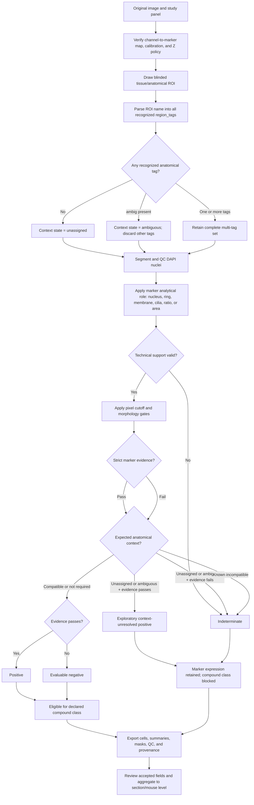

# Compartment Tags, Analytical Roles, and Call Progression

The pipeline uses two different kinds of “compartment.” They answer different
questions and must not be substituted for each other:

1. **Anatomical/context tags** describe where the ROI is located: airway,
   alveolar, tumor, fibrotic, stromal, vascular, immune, ambiguous, or
   unassigned.
2. **Analytical subcellular roles** describe where marker signal is measured
   relative to a nucleus: nucleus, cytoplasmic ring, membrane-support ring,
   apical cilia, nuclear ratio, or regional area.

An anatomical tag does not prove cell identity. A subcellular role does not
prove anatomy.

## 1. Anatomical/context tags

| Exported tag/state | Recognized ROI-name text | Intended description | What it authorizes | What it does not mean |
|---|---|---|---|---|
| `airway` | `airway`, `bronch`, for example `airway_01` or `bronchial_01` | Conducting-airway or bronchiolar epithelium/lumen selected independently of the target marker | Context eligibility for airway-restricted endpoints such as AcTub ciliated-cell negatives | It does not identify club, basal, ciliated, goblet, or tumor cells by itself |
| `alveolar` | Any text containing `alveol`, for example `alveolar_01` or `alveoli_02` | Distal gas-exchange parenchyma selected independently of the target marker | Context eligibility for alveolar endpoints such as AGER, PDPN/T1alpha, mRAGE, or Pro-SPC negatives | It does not distinguish AT1 from AT2 or exclude airway-derived repair cells |
| `tumor` | `tumor`, `tumour`, or `luad` | Histologically or experimentally defined tumor ROI | Eligibility for tumor-restricted study endpoints and tumor-specific compound classifications | Marker expression inside the ROI does not prove malignancy, grade, origin, or genotype |
| `fibrotic` | `fibrot`, `honeycomb`, or `uip` | Morphologically defined scarred, remodeled, honeycomb, or UIP-pattern region | Eligibility for fibrosis/remodeling endpoints and combined tags such as `alveolar_fibrotic` | It is not a diagnosis and does not identify a fibrotic cell lineage |
| `stromal` | `strom` or `mesench` | Mesenchymal/connective-tissue region separated from epithelium when possible | Eligibility for stromal, fibroblast-associated, or perivascular mesenchymal endpoints | It does not distinguish fibroblast, myofibroblast, smooth muscle, or pericyte |
| `vascular` | `vascul`, `vessel`, or `capillar` | Blood-vessel or capillary-associated region | Eligibility for endothelial/perivascular spatial endpoints | It does not distinguish endothelial subtype, pericyte, smooth muscle, or intravascular immune cell |
| `immune` | `immune`, `inflamm`, or `lymph` | Immune-rich, inflammatory, or lymphoid region | Eligibility for immune-compartment endpoints | It does not identify a specific immune lineage or activation state |
| `ambiguous` | Any text containing `ambig` | Anatomy cannot be assigned reliably or the ROI intentionally contains inseparable contexts | Preserves strict positive marker evidence as context-unresolved when allowed | It never authorizes a biological negative or a context-dependent compound identity |
| `unassigned` | No recognized tag and no whole-field override | No anatomical/context decision was supplied | Nothing context-dependent; it records that context is missing | It is not equivalent to normal, negative, background, or ambiguous anatomy |

### Multiple tags

An ROI may contain several compatible descriptors, for example:

- `alveolar_fibrotic_01`;
- `tumor_stromal_02`;
- `vascular_fibrotic_03`.

All recognized labels are exported in `region_tags`, separated by `|`.
Marker eligibility uses the full tag set: a marker with
`expectedCompartments: ["alveolar", "tumor"]` passes when either tag is
present.

The single `compartment` column exists for older downstream tools. Its display
precedence is:

1. `ambiguous`;
2. `alveolar`;
3. `airway`;
4. `unassigned` when no tag exists;
5. otherwise the first recognized tag.

This precedence does not discard the other `region_tags` for decisions. If an
ROI name contains `ambig`, the parser intentionally replaces every other tag
with `ambiguous`.

## 2. Analytical subcellular roles

| Role | Measurement support | Typical markers | Main decision requirement |
|---|---|---|---|
| `nuclear` | DAPI/Hoechst object | DAPI | Segmentation only; it is not a non-DAPI marker call |
| `nuc_marker` | Signal inside the DAPI nucleus, with a reference ring | p63/TP63, Sox2, SOX9, Ki-67, NKX2-1 | Connected nuclear coverage and nuclear enrichment |
| `nuc_ratio` | Nuclear signal compared with a cytoplasmic reference ring | YAP | Nuclear coverage plus nuclear:cytoplasmic ratio; single plane or validated 3D workflow |
| `cyto` | Perinuclear cytoplasmic ring | KRT5, KRT8, Pro-SPC, CC10, tdTomato, KRAS reporters | Connected extranuclear support and unique ownership when required |
| `membrane` | Thin nucleus-associated membrane-support ring | AGER, PDPN/T1alpha, mRAGE, ITGA2, PDGFRB, EPCAM | Connected membrane-like support and unique ownership when required |
| `apical_cilia` | Nucleus-associated apical ciliary component/support shell | Acetylated alpha-tubulin, TUBB4A | Accepted ciliary component, spatial proximity, coverage, and connectedness |
| `regional_area` | Independent positive-area mask rather than a nucleus-owned cell call | COL1A1, CTHRC1, ACTA2, mucins; PDGFRB at modest resolution | Control-derived threshold and study-validated component size; no per-nucleus negative |

The role determines *where and how* signal is measured. The anatomical tag
determines *whether the biological endpoint is context-eligible*.

## 3. Progression from image to final call

### Step-by-step interpretation

1. **Panel selection:** choose the acquisition channel map before examining
   marker positivity.
2. **Blinded ROI assignment:** draw/nickname ROIs using anatomy and the study
   design, not the target marker channel.
3. **Tag parsing:** the pipeline extracts every recognized context word from
   the ROI name. The whole-field override is used only when the entire field is
   independently known to be homogeneous.
4. **Nuclear segmentation:** DAPI candidates are segmented; undersized and
   edge-touching candidates are rejected. A missing nucleus is a segmentation
   omission, not a marker-negative cell.
5. **Role-specific measurement:** each non-DAPI marker is measured in its
   declared analytical support.
6. **Strict marker evidence:** coverage, connectedness, localization,
   enrichment, projection validity, and ownership are evaluated.
7. **Context comparison:** the observed `region_tags` are compared with the
   marker channel's `expectedCompartment` or `expectedCompartments`.
8. **Three-state/asymmetric call:** compatible context permits positive and
   negative calls. Unresolved context permits strict exploratory positives but
   not negatives. Known incompatible context is indeterminate for the intended
   endpoint.
9. **Compound classification:** lineage/state combinations consume only
   context-resolved positive or negative calls. Every declared class is
   exported even if all cells are indeterminate.
10. **QC and aggregation:** call overlays and provenance are reviewed before
    accepted regions are pooled to the biological replicate.

## 4. Practical ROI naming examples

| Intended ROI | Recommended name | Exported `region_tags` |
|---|---|---|
| Conducting airway | `airway_01` | `airway` |
| Bronchiole | `bronchial_02` | `airway` |
| Normal-appearing alveolar parenchyma | `alveolar_01` | `alveolar` |
| Fibrotic alveolar remodeling | `alveolar_fibrotic_01` | `alveolar|fibrotic` |
| Tumor epithelium | `tumor_01` or `luad_01` | `tumor` |
| Tumor-associated stroma | `tumor_stromal_01` | `tumor|stromal` |
| Fibrotic perivascular region | `vascular_fibrotic_01` | `fibrotic|vascular` |
| Immune aggregate | `immune_lymphoid_01` | `immune` |
| Deliberately mixed/uncertain anatomy | `ambiguous_01` | `ambiguous` |

Avoid names such as `positive_01`, `negative_01`, `marker_high`, or
`interesting_area`. They do not define anatomy and can introduce target-channel
bias.
