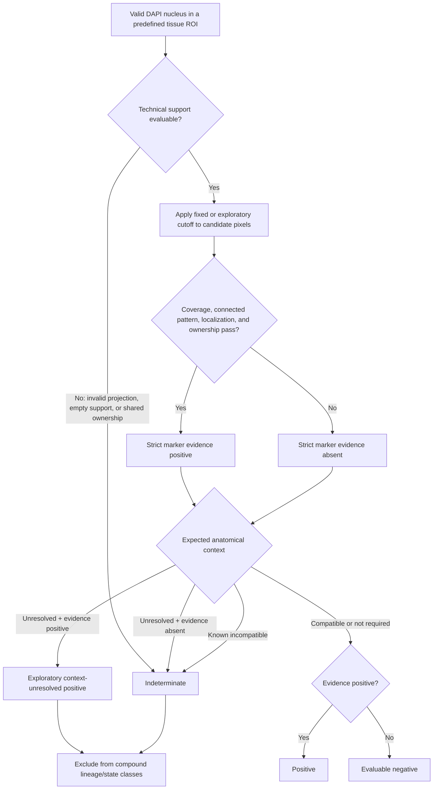

# Marker Morphology and Decision Hierarchy

This document is the authoritative interpretation guide for
`IF_Quant_Pipeline.groovy`. The final marker call is morphology-first. Mean
intensity is retained for audit, but it does not authorize a positive or
negative call.

The numeric values below are conservative pilot defaults. They are not universal
biological cutoffs. Derive intensity cutoffs and confirm morphology parameters
with blinded negative and positive controls, then freeze them before comparing
experimental groups.

## 1. Authoritative decision hierarchy



The hierarchy has three important consequences:

1. A high object mean alone cannot produce a final positive.
2. A low object mean does not force a negative if a thin or localized structure
   has enough connected pixels above the cutoff.
3. Missing spatial information is `indeterminate`, not negative. This prevents
   failed segmentation, ambiguous ownership, or an unassigned compartment from
   silently increasing the negative group.

For every compartment-dependent cell-call marker, strict marker evidence may be
retained as an exploratory positive when anatomy is unresolved, but evidence
absence cannot become negative until a compatible compartment is independently
assigned. Evidence in a known incompatible compartment is retained in audit
fields but remains indeterminate for the intended endpoint. Context-unresolved
positives cannot authorize compound lineage/state classes.

An image-specific Otsu cutoff is allowed for pilot exploration. Calls using it
are exported as `exploratory_positive` or `exploratory_negative`. A confirmatory
call requires a fixed cutoff declared before analysis from appropriate controls.

## 2. Gate definitions

For a marker-specific support region, the pipeline calculates:

- **Positive fraction:** fraction of support pixels at or above the marker
  cutoff.
- **Largest-component share:** fraction of positive pixels belonging to the
  largest 8-connected component. This rejects scattered bright specks.
- **Localization:** nuclear enrichment for p63/Sox2, nuclear-to-cytoplasmic
  ratio for YAP, or the appropriate perinuclear/apical support for other roles.
- **Ownership:** whether another included nucleus lies inside the same support
  region. Shared support is indeterminate when unique attribution is required.
- **Compartment/context:** whether the endpoint is in a compatible airway,
  alveolar, tumor, fibrotic, stromal, vascular, or immune ROI. Missing context
  is asymmetric: strict positive evidence may be retained; negative evidence
  remains indeterminate.

The final positive is the logical AND of all applicable morphology gates and
the context policy. A final negative is allowed only when technical support and
any required anatomical context are evaluable.

## 3. Current pilot defaults

| Marker | Role and support | Minimum positive fraction | Minimum largest-component share | Additional gate |
|---|---|---:|---:|---|
| KRT5 | Perinuclear cytoplasmic ring; independent pod area also reported | 0.20 | 0.50 | Unique ownership |
| KRT8 | Perinuclear cytoplasmic filament support; optional epithelial positive area | 0.20 | 0.40 | Unique ownership; a KRT8-high transitional interpretation requires a separately frozen abundance cutoff, geography, and co-markers |
| ITGA2/CD49b | Membrane-support ring | 0.25 | 0.40 | Unique ownership; require intended epithelial/tumor/stromal/immune context because ITGA2 is not lineage-specific |
| PDGFR-beta/CD140b | Membrane-support ring only for validated high-resolution cell calls; regional/perivascular area preferred at 20x | 0.25 | 0.40 | Unique ownership; stromal/vascular/fibrotic ROI and vessel relationship; co-markers required for cell identity |
| Red2-KrasG12D RFP | Perinuclear RFP reporter support; independent clone area is primary at 20x | 0.20 | 0.40 | Unique ownership for secondary cell association; RFP-positive marks the oncogene-coupled clone, but RFP-negative alone is not a wild-type call |
| KRAS | Perinuclear cytoplasmic/membrane-associated support | 0.20 | 0.40 | Unique ownership; pan-KRAS positivity is protein-pattern only and never a mutation call |
| AGER | Membrane-support ring | 0.25 | 0.40 | Alveolar ROI; unique ownership |
| PDPN/T1A | Membrane-support ring | 0.25 / 0.30 | 0.40 | Alveolar ROI; unique ownership |
| Pro-SPC | Perinuclear granular cytoplasm | 0.15 | 0.40 | Alveolar ROI; unique ownership |
| CD4/CD8 | Nucleus-associated membrane proxy | 0.20 | 0.40 | Unique ownership |
| Sox2 | DAPI nucleus | 0.40 | 0.60 | Nuclear:ring enrichment at least 1.25 |
| SOX9 | DAPI nucleus | 0.40 | 0.60 | Nuclear:ring enrichment at least 1.25; cytoplasmic-only signal is not positive |
| Ki-67/MKI67 | DAPI nucleus | 0.10 | 0.30 | Nuclear:ring enrichment at least 1.25; report a labeling index within a predeclared population/ROI |
| p63 | DAPI nucleus | 0.40 | 0.60 | Nuclear:ring enrichment at least 1.25 |
| YAP | DAPI nucleus plus cytoplasmic reference ring | 0.30 | 0.60 | Nuclear:cytoplasmic ratio at least 1.50; single plane |
| Aqp5 | Perinuclear support | 0.20 | 0.40 | Unique ownership |
| CC10/SCGB1A1 | Perinuclear secretory cytoplasm | 0.20 | 0.40 | Unique ownership |
| tdTomato | Perinuclear reporter support; independent reporter area also reported | 0.20 | 0.40 | Unique ownership |
| Acetylated tubulin | Unique nearest ciliary component in a 1-6 um apical shell | 0.10 | 0.30 | Contextual positive allowed if all gates pass; negative requires airway ROI; regional patches are primary at 20x |
| mRAGE | Membrane-support ring | 0.30 | 0.40 | Alveolar ROI; unique ownership |

The AcTub regional patch filter is 2.0 um2. The previous 0.5 um2 filter was only
about five pixels at the tested 0.311 um/pixel calibration and was too permissive
for a structure-level criterion.

Every value can be overridden without editing the script:

```powershell
$env:IFQ_CC10_THRESHOLD = 'control-derived-value'
$env:IFQ_CC10_MIN_POSITIVE_FRACTION = '0.20'
$env:IFQ_CC10_MIN_LARGEST_COMPONENT_SHARE = '0.40'
$env:IFQ_KRT8_MIN_POSITIVE_FRACTION = '0.20'
$env:IFQ_ITGA2_MIN_POSITIVE_FRACTION = '0.25'
$env:IFQ_PDGFRB_MIN_POSITIVE_FRACTION = '0.25'
$env:IFQ_RED2KRAS_THRESHOLD = 'control-derived-rfp-value'
$env:IFQ_RED2KRAS_MIN_POSITIVE_FRACTION = '0.20'
$env:IFQ_KRAS_MIN_POSITIVE_FRACTION = '0.20'
$env:IFQ_KI67_THRESHOLD = 'control-derived-nuclear-value'
$env:IFQ_KI67_MIN_POSITIVE_FRACTION = '0.10'
$env:IFQ_YAP_MIN_NUC_CYTO_RATIO = '1.50'
$env:IFQ_P63_MIN_NUCLEAR_ENRICHMENT = '1.25'
$env:IFQ_SOX9_MIN_NUCLEAR_ENRICHMENT = '1.25'
$env:IFQ_ACTUB_MIN_SUPPORT_FRACTION = '0.10'
$env:IFQ_ACTUB_MIN_PATCH_AREA_UM2 = '2.0'
```

Use `IFQ_<MARKER>_THRESHOLD` for a fixed marker cutoff. Non-alphanumeric marker
characters are removed from the environment token, so `tdTOM` becomes
`IFQ_TDTOM_THRESHOLD` and `mRAGE` becomes `IFQ_MRAGE_THRESHOLD`.

## 4. Marker-specific interpretation

### Nuclear markers: p63 and Sox2

Positive signal must occupy a substantial, connected part of the DAPI nucleus
and be enriched relative to a reference ring. This is stricter than nucleus mean
intensity and rejects isolated nuclear specks and perinuclear blur.

### Nuclear localization marker: YAP

YAP is a localization phenotype, not merely a nuclear-intensity marker. Require
both connected nuclear support and the nuclear:cytoplasmic ratio. Use a single
optical plane or a validated 3D workflow; a maximum projection mixes different
depths and makes the ratio non-local.

### Cytoplasmic and reporter markers

KRT5, Pro-SPC, CC10, and tdTomato use a perinuclear ring because the nucleus
itself is not the expected signal compartment. Connected thresholded coverage is
primary. Whole-marker area remains important for dense KRT5 pods and tdTomato
reporter fields that cannot be represented reliably by one nucleus-centered
measurement per cell.

CC10 denotes current secretory protein phenotype. It does not, by itself, prove
club-cell ancestry after injury. tdTomato denotes recombination history, not
current cell identity.

#### KRT8

KRT8 is a cytoplasmic intermediate-filament network. A positive cell therefore
requires connected extranuclear/perinuclear support rather than a bright
nuclear overlap or isolated specks. The per-nucleus call answers **KRT8 protein
detected with the expected cytoplasmic pattern**; it does not answer
**transitional epithelial cell**. A DATP/ADI/PATS-like interpretation requires
an alveolar or fibrotic ROI, a predeclared KRT8-high abundance definition, and
co-markers such as CLDN4 together with AT2/AT1 lineage context. Broad airway or
tumor KRT8 expression must not be relabeled as an injury transition state.

#### Red2-KrasG12D RFP reporter

Red2-Kras is not a KRAS antibody stain. In the Red2Onco construct, tdimer2 RFP
is coupled to ectopic `KrasG12D`, so a recombined red clone co-expresses the
oncogene. Analyze the RFP channel as a cytoplasmic lineage/clone reporter:

1. derive and freeze the RFP pixel threshold from Cre-negative, uninduced, and
   acquisition-matched controls;
2. require connected cytoplasmic reporter support rather than red-channel
   autofluorescence, isolated puncta, or nuclear bleed-through;
3. at 20x, use filtered RFP-positive clone area divided by the blinded tissue
   or whole-lobe ROI area as the primary burden endpoint;
4. treat nucleus-associated Red2-Kras-positive counts as secondary because
   confluent clone signal and shared support can make ownership indeterminate;
5. for proliferation, report `Ki-67-positive / evaluable Red2-Kras-positive`
   nuclei, retaining the joint RFP/Ki-67 indeterminate cases in QC.

An RFP-positive call identifies a Red2Onco `KrasG12D`-coupled clone when the
mouse genotype, Cre driver, induction, and reporter channel have been verified.
It is not direct KRAS protein or allele immunostaining. An RFP-negative cell is
not automatically wild type: it can be unrecombined or unlabelled. Only the
separately expressed non-red Confetti reporters provide labelled wild-type
comparators under the Red2Onco design. Connected-component count is also not a
clone count after neighbouring red regions merge.

#### Pan-KRAS protein staining

Pan-KRAS protein is expected in inner-membrane-associated and cytoplasmic or
punctate patterns. A positive image call requires connected extranuclear
support owned by the nucleus-associated cell proxy; nuclear-only overlap,
isolated puncta, and diffuse field background do not qualify. This endpoint
means **KRAS protein-pattern positive** only. It cannot determine KRAS mutation,
allele, oncogenic signaling, tumor identity, or malignancy. A mutant-specific
endpoint must include the allele in the marker name (for example KRAS G12C),
use an allele-specific antibody with appropriate controls, and be validated
against an independent molecular genotyping assay.

### Membrane markers

AGER, PDPN/T1A, mRAGE, CD4, and CD8 are membrane-associated. Their signal can be
thin and bright while the mean over a larger ring is low. The positive fraction
and connected-pattern gates are therefore more appropriate than a ring mean.
AGER, PDPN/T1A, and mRAGE require alveolar anatomical context for the specified
AT1 interpretation.

#### ITGA2/CD49b (user label `IGTA2`)

ITGA2 is an integrin surface receptor, although antibody and tissue processing
can also produce cytoplasmic staining. Use connected membrane-support coverage
as the primary morphology gate; do not count diffuse background or isolated
puncta. ITGA2/CD49b is expressed by more than one epithelial, tumor, stromal,
platelet, and immune population, so positivity is not a cell-identity call.
Interpret it only inside a pre-annotated compartment with the relevant
epithelial, tumor, stromal, or immune co-markers. `IGTA2` is accepted by the
registry as a typo-tolerant alias, but `ITGA2` is the canonical symbol.

#### PDGFR-beta/CD140b

PDGFR-beta signal belongs to elongated or branching perivascular/stromal cells
and may extend well beyond the nearest nucleus. At 20x, the primary endpoint
should be connected regional positive area, component distribution, and—when
available—distance/association with a CD31-positive vessel mask. A per-nucleus
membrane call is secondary and should be enabled only after high-resolution
validation of ownership. PDGFR-beta alone does not establish pericyte or
myofibroblast identity: use stromal/vascular/fibrotic ROIs and supporting
markers, while excluding endothelial and epithelial interpretations.

### SOX9

SOX9 is a transcription factor. Require connected signal within the DAPI
nucleus and enrichment over the perinuclear reference ring. Cytoplasmic-only
staining, perinuclear haze, and isolated nuclear specks are negative or
indeterminate according to evaluability—not SOX9-positive. Developmental distal
tip, airway gland progenitor, injury-associated epithelial, fibrotic, and tumor
interpretations require the corresponding anatomical ROI and co-markers; SOX9
alone is neither a lineage nor malignancy classifier.

### Ki-67/MKI67

Ki-67 is a nuclear proliferation antigen with cell-cycle-dependent diffuse,
granular, and nucleolar/chromatin-associated patterns. Its morphology rule is
therefore localization-dominant: connected signal must lie inside the DAPI
nucleus and be enriched above the reference ring, while the required occupied
nuclear fraction is lower than for transcription factors such as SOX9 or p63.
The 0.10 coverage and 0.30 largest-component values are conservative pilot
image-analysis gates, not clinical scoring cutoffs. Report
`Ki-67-positive nuclei / evaluable nuclei` within a predeclared lineage or tumor
ROI; whole-field Ki-67 mixes epithelial, stromal, endothelial, and immune
proliferation. A high/low boundary must be study-specific because lung-cancer
Ki-67 scoring is not universally standardized.

### Acetylated alpha-tubulin

AcTub is concentrated in apical cilia. At 20x, the primary endpoint is regional
ciliary-patch area and component distribution, not an individual-cilium count.
For a cellular association, each accepted ciliary component is assigned to one
nearest nucleus only. Its centroid must be 1-6 um outside the approximate
nuclear boundary, while the nucleus-centered support must satisfy the 0.10
positive-coverage and 0.30 connected-pattern requirements.

In an ambiguous or unassigned field, passing this full rule authorizes only an
`exploratory_positive_cellular_context` call. Non-passing nuclei remain
indeterminate because the field was not independently established as airway.
Known non-airway ROIs remain non-interpretable for this endpoint. A negative
AcTub cell call requires an independently drawn/named airway ROI. This
asymmetry prevents the target channel from declaring its own negatives while
still allowing strict positive cellular associations.

## 5. Sectioning rules

### Optical sectioning

- One-plane acquisitions are analyzed as that plane.
- Maximum projection is acceptable for robust area measurements when validated.
- YAP nuclear:cytoplasmic analysis requires a representative single plane or a
  validated 3D method.
- Apical cilia are best assessed in a single apical plane or restricted apical Z
  range when a stack is available.
- SOX9 nuclear ownership is safest in a representative single plane or a
  validated 3D nuclear workflow, especially in dense glandular or tumor fields.
- Ki-67 per-cell scoring likewise requires a representative single plane or
  validated 3D nuclear ownership; maximum projections can merge adjacent
  proliferating nuclei and inflate the labeling index.
- KRT8, ITGA2, and PDGFR-beta maximum projections can merge support from cells
  at different depths. Use a single/restricted Z range for per-cell calls;
  validated projections may still be used for explicitly regional area endpoints.
- Red2-Kras RFP clone-area analysis may use a validated projection when the
  same Z policy is frozen across samples. Per-nucleus RFP/Ki-67 association
  requires a representative plane, restricted Z range, or validated 3D method.

The tested G002 and G003 Olympus OIR files each contain one optical section, so
no marker-specific Z projection is needed for those two files.

### Anatomical sectioning

Draw ROIs without consulting the target marker channel, then name them:

- `airway`, `airway_01`, or `bronchial_01`;
- `alveoli` or `alveolar_01`;
- `ambiguous` or `ambiguous_01`.

Use `IFQ_COMPARTMENT_MODE=required` for study runs. An unrecognized or ambiguous
required compartment produces indeterminate calls for compartment-dependent
markers.

For a visually reviewed, anatomically homogeneous field only,
`IFQ_WHOLE_FIELD_COMPARTMENT` can record any supported explicit anatomical
context in provenance. Do not use this override on a mixed field; draw separate
compartment ROIs or use `ambiguous` instead.

### Analytical sectioning

Choose one of: nucleus, perinuclear cytoplasmic ring, membrane-support ring,
independent area mask, apical cilia support, or nuclear:cytoplasmic ratio. These
units are not interchangeable.

## 6. Exported decision fields

The per-cell CSV includes:

- `<marker>_mean` and `<marker>_pos`: legacy mean-intensity audit values;
- `<marker>_support_fraction_above_threshold`;
- `<marker>_largest_positive_component_share`;
- `<marker>_fraction_pass`, `<marker>_connected_pattern_pass`,
  `<marker>_ownership_clear`, `<marker>_enrichment_pass`, and
  `<marker>_compartment_pass`;
- `<marker>_marker_evidence_pass`, `<marker>_context_resolved`,
  `<marker>_context_state`, and `<marker>_negative_eligible`;
- `<marker>_final_call`: `1`, `0`, or blank;
- `<marker>_call_status`: positive, negative, exploratory positive/negative,
  exploratory context-unresolved positive, or indeterminate;
- `<marker>_call_reason`;
- `<marker>_true_pos`: compatibility alias for the final call.

The region summary separately reports raw mean-intensity counts, morphology
positive counts, morphology negative counts, indeterminate counts, strict
marker-evidence-positive counts, context-unresolved positives,
context-excluded positive evidence, and separate context-resolved positive,
evaluable, and positive-fraction fields. Classification rules use
`<marker>_final_call` plus resolved context, never `<marker>_pos`.

Each marker also receives a morphology-positive nuclei label mask and an
indeterminate nuclei label mask for QC, plus a call-QC PNG with positives in
green, evaluable negatives in cyan, and indeterminate nuclei in magenta.

## 7. One-image-per-panel morphology-primary pilot

The final pilot is a hierarchy test, not a biological endpoint. It used one 20x
G002 field from panel E and one 20x G002 field from panel R:

| Panel/field | Nuclei | Marker morphology + / - / indeterminate | Filtered regional area |
|---|---:|---:|---:|
| E / G002 | 2,909 | CC10 1,431 / 1,340 / 138 | tdTomato 35,371.4 um2 (8.73%) |
| E / G002 | 2,909 | tdTomato 659 / 2,112 / 138 | AcTub 25,171.6 um2 (6.22%) |
| E / G002 | 2,909 | AcTub 0 / 0 / 2,909 | Compartment unassigned |
| R / G002 | 2,108 | T1A 429 / 1,571 / 108 | 29,792.5 um2 (7.36%) |
| R / G002 | 2,108 | tdTomato 1,183 / 817 / 108 | 73,498.7 um2 (18.15%) |
| R / G002 | 2,108 | mRAGE 113 / 1,887 / 108 | 12,203.2 um2 (3.01%) |

All calls and areas are exploratory because the pilot used image-specific Otsu
thresholds. The mixed panel-E field was not forced to `airway`, so all AcTub
per-cell calls are indeterminate. The inspected panel-R field was homogeneous
alveolar parenchyma and used a provenance-recorded whole-field `alveolar`
assignment. See [`PILOT_G002_MORPHOLOGY_RESULTS.md`](PILOT_G002_MORPHOLOGY_RESULTS.md)
for full results.

## 8. QC and control acceptance

Before accepting a field, verify:

- channel order and calibration;
- DAPI split/merge quality and rejected candidates;
- threshold boundaries follow the intended structure;
- connected-support gates reject isolated bright specks;
- shared support is not forced to a cell;
- airway/alveolar/ambiguous labels are defensible;
- no blank final call was converted to zero;
- fixed thresholds and morphology parameters were frozen before group analysis;
- biological replication is aggregated at mouse level, not section or field.

## 9. Literature basis

- YAP activity is associated with nuclear localization rather than total signal:
  [PMC5360446](https://pmc.ncbi.nlm.nih.gov/articles/PMC5360446/).
- Acetylated tubulin is used to identify ciliated airway cells:
  [PMC3604083](https://pmc.ncbi.nlm.nih.gov/articles/PMC3604083/).
- Airway epithelial marker organization includes CC10 and apical cilia:
  [PMC11212965](https://pmc.ncbi.nlm.nih.gov/articles/PMC11212965/).
- Podoplanin is a thin cell-surface marker and RAGE/PDPN mark AT1 phenotypes:
  [PMC2542444](https://pmc.ncbi.nlm.nih.gov/articles/PMC2542444/),
  [PMC8480975](https://pmc.ncbi.nlm.nih.gov/articles/PMC8480975/).
- KRT5-positive injury-associated pods and lineage interpretation:
  [PMC5906746](https://pmc.ncbi.nlm.nih.gov/articles/PMC5906746/),
  [PMC4312207](https://pmc.ncbi.nlm.nih.gov/articles/PMC4312207/).
- KRT8-positive squamous transitional cells arise during alveolar regeneration
  and can persist in fibrosis:
  [PMC7366678](https://pmc.ncbi.nlm.nih.gov/articles/PMC7366678/),
  [PMC7461628](https://pmc.ncbi.nlm.nih.gov/articles/PMC7461628/).
- ITGA2 in NSCLC has membrane and assay-dependent cytoplasmic staining and is
  not a lineage-specific marker:
  [Oxford Academic, 2023](https://academic.oup.com/jjco/article/53/1/63/6712360).
- Lung PDGFR-beta-positive pericyte-like cells are elongated/branching and
  spatially associated with, but distinct from, CD31-positive vessels:
  [PMC6337011](https://pmc.ncbi.nlm.nih.gov/articles/PMC6337011/),
  [PMC5407093](https://pmc.ncbi.nlm.nih.gov/articles/PMC5407093/).
- SOX9 is nuclear in lung progenitor programs and is also observed in subsets
  of lung adenocarcinoma, requiring context rather than a stand-alone identity
  call:
  [PMC9406614](https://pmc.ncbi.nlm.nih.gov/articles/PMC9406614/),
  [PMC4116509](https://pmc.ncbi.nlm.nih.gov/articles/PMC4116509/).
- KRAS is membrane-associated with cytoplasmic/punctate protein signal, but
  mutation status is a molecular endpoint and must not be inferred from pan-KRAS
  morphology:
  [PMC10084885](https://pmc.ncbi.nlm.nih.gov/articles/PMC10084885/),
  [PMC8870399](https://pmc.ncbi.nlm.nih.gov/articles/PMC8870399/).
- The Red2Onco system couples the oncogene cassette to tdimer2 RFP so RFP-positive
  clones co-express the oncogene; recent lung work quantifies RFP-positive mutant
  clone area relative to whole-lobe area:
  [PMC7614896](https://pmc.ncbi.nlm.nih.gov/articles/PMC7614896/),
  [MGI:7259836](https://www.informatics.jax.org/allele/MGI%3A7259836),
  [Nature 2026](https://doi.org/10.1038/s41586-026-10399-6).
- Ki-67 is a nuclear proliferation marker. In lung research it is reported as a
  positive-cell labeling index, but no universal lung-cancer scoring method is
  established:
  [PubMed 2266458](https://pubmed.ncbi.nlm.nih.gov/2266458/),
  [PMC6422775](https://pmc.ncbi.nlm.nih.gov/articles/PMC6422775/).

## 10. Related files

- [`../IF_Quant_Pipeline.groovy`](../IF_Quant_Pipeline.groovy): implementation
  and parameter provenance.
- [`../README.md`](../README.md): installation, execution, outputs, and
  statistics.
- [`../aggregate_to_mouse.py`](../aggregate_to_mouse.py): mouse-level
  aggregation after section QC.
